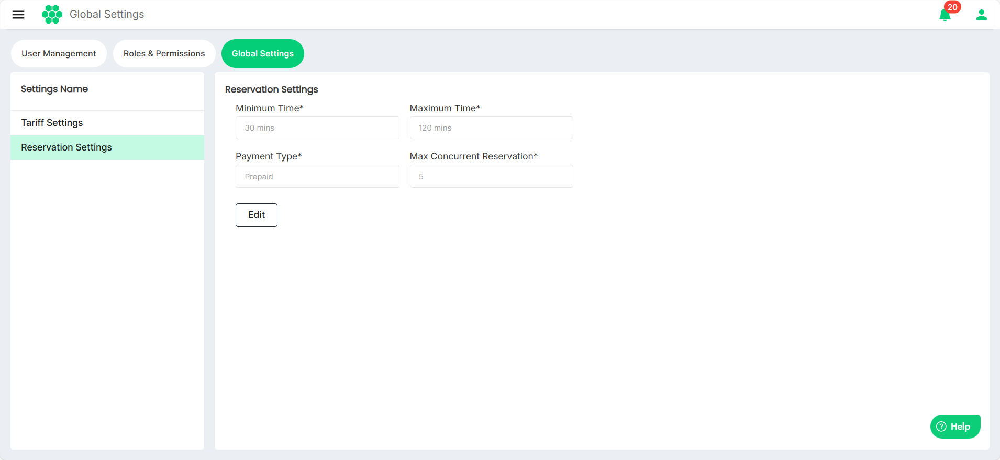
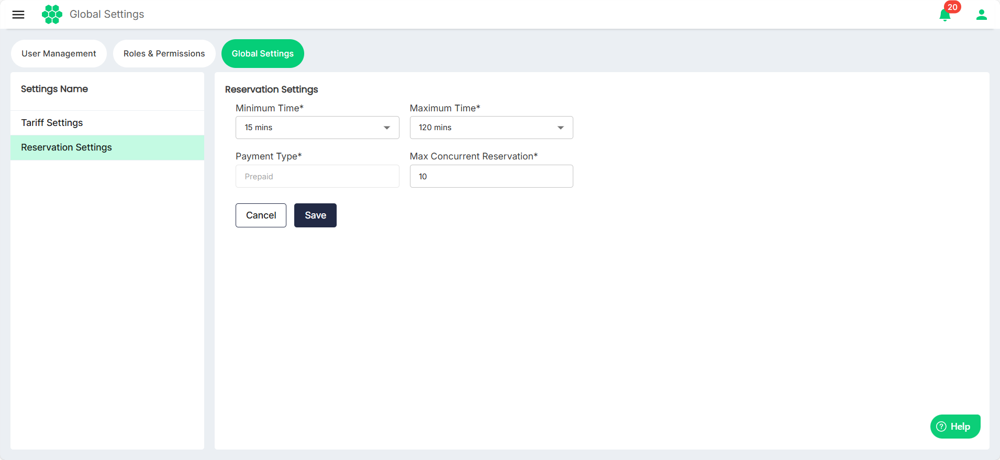

# Modifying Reservation Settings

To modify reservations settings, follow these steps:
1. Navigate to **Administration** > **Global Settings**. 
2. Click on **Reservation Settings** on the left. The following screen appears, which displays the reservation settings:
3. Click on the **Edit** button.
4. Make the desired changes.
	- **Minimum Time**: Set the minimum reservation time allowed per booking.
	- **Maximum Time**: Set the maximum reservation time allowed per booking.
	- **Payment Type**: Choose whether reservation payments are post-paid or pre-paid.
	- **Max Concurrent Reservations**: Set the maximum number of concurrent reservations a customer can book at any given time.
5. Click **Save**.