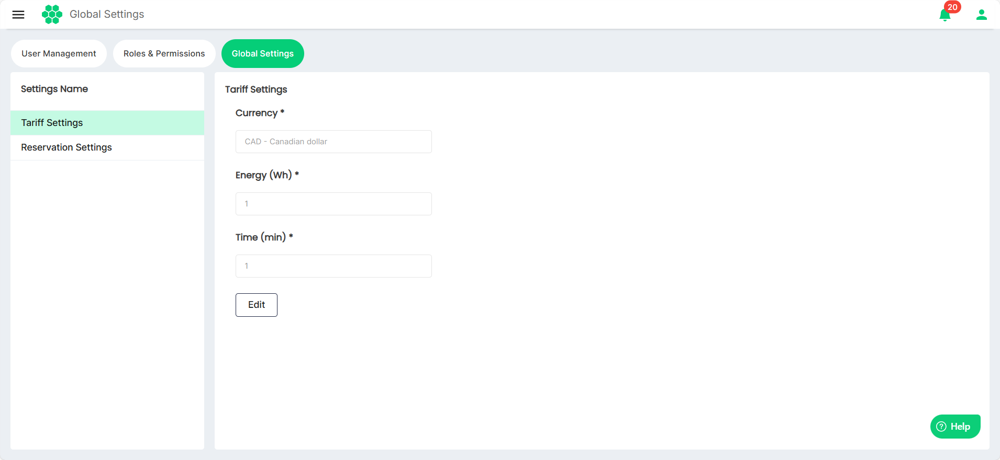
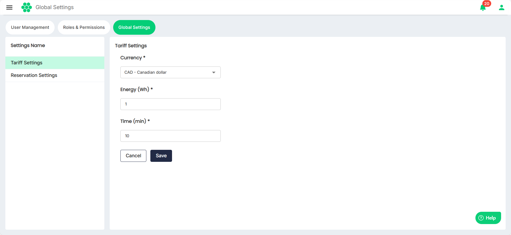

# Modifying Tariff Settings

To modify tariff settings, follow these steps:
1. Navigate to **Administration** > **Global Settings**. The following screen appears, which displays the tariff settings:
2. Click on the **Tariff Setting** on the left. Then, click on the **Edit** button.
3. Make the desired changes.
	- **Currency**: Choose the currency for transactions.
	- **Energy and Time**: Define the minimum billing unit. This unit will be billed in step size blocks. Amounts less than this step size are rounded up to the nearest step size.
	
	   Example: If the type is Time and the step size is 300 seconds (5 minutes), then time will be billed in 5-minute blocks. If 6 minutes are used, 10 minutes (2 blocks) will be billed.
5. Click **Save**.