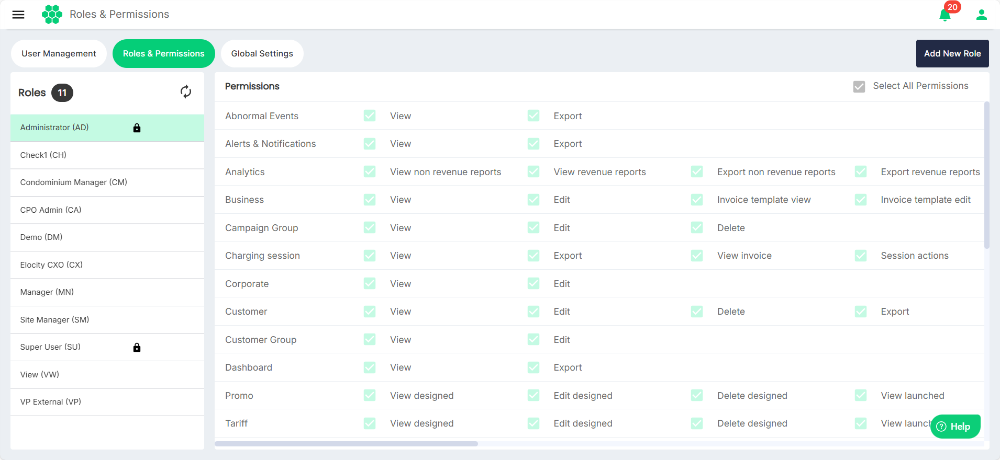
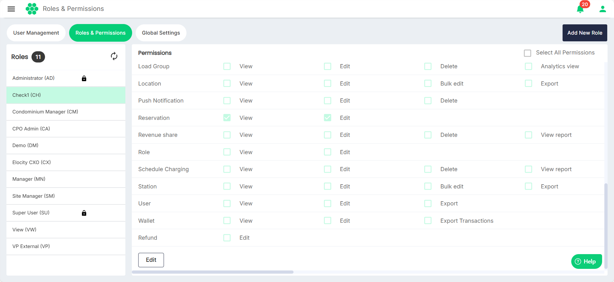
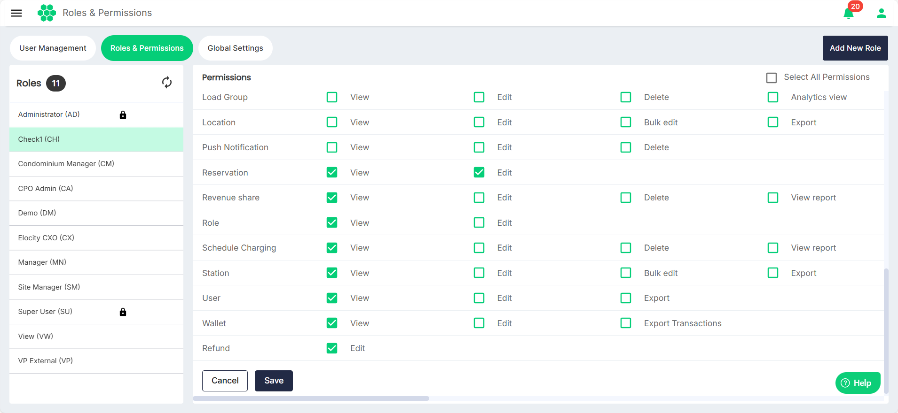

# Editing Permissions

To edit permissions associated with a role, follow these steps:
1. Navigate to **Administration** > **Roles & Permissions**. The following screen appears, which lists all the existing roles and the associated permissions.
2. Click on a role name on the left. The associated permissions appear on the right. 
3. Click the **Edit** button.
4. Select all the permissions you want to associate with the role.
5. Click **Save**.