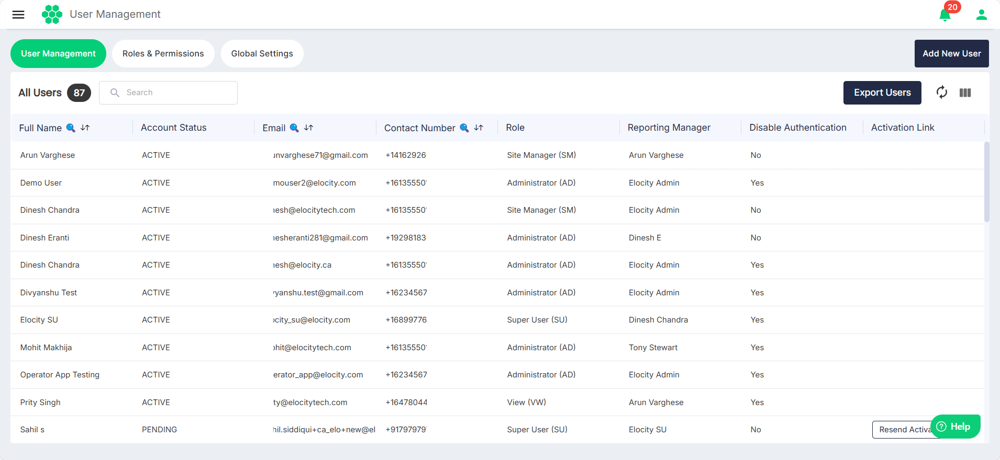
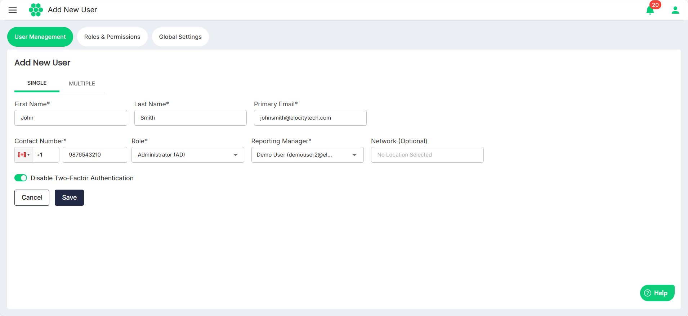
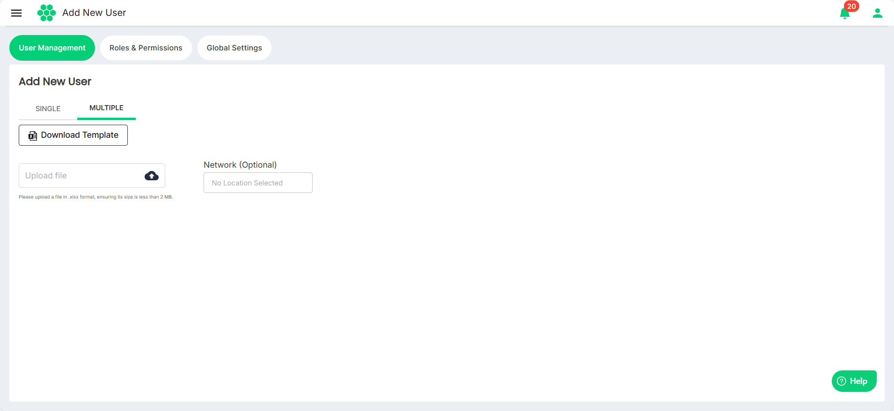

# Adding Users
You can add a [single user](#adding-single-user) or [multiple users](#adding-multiple-users) at once.
## Adding Single User

To add a user, follow these steps:
1. Navigate to **Administration** > **User Management**. The following screen appears, which lists all the existing users:
2. Click the **Add New User** button. The Add New User screen appears:
3. Under the SINGLE tab, enter the following details:
	- **First Name**
	- **Last Name**
	- **Primary Email** (To be used for communication and login purposes
	- **Contact Number**
	- **Role** (Determines the level of access and functionalities available to the user in the web portal.
	- **Reporting Manager** (Must already have access to the web portal._
	- **Network** (The locations the new user will have access to. Access to specific chargers will be granted based on the user’s role and network access.)
1. Click the the **Disable Two-Factor Authentication** to enable or disable two-factor authentication. If enabled, the user will need to provide an OTP (One-Time Password) received via email at the time of login
2. Click **Save**.

:::note
All the required fields marked with an asterisk (*) are mandatory. 
:::
## Adding Multiple Users
To add multiple users at once, follow these steps:
1. Navigate to **Administration** > **User Management**. The following screen appears, which lists all the existing users:
2. Click the **Add New User** button. The Add New User screen appears:
3. Click the **MULTIPLE** tab, the following screen appears:
4. Click the **Download Template** button. The User Add Template.xlsx gets downloaded to your computer.
5. Complete the template with the necessary information for each user.
6. Once filled, click the **Upload file** button to upload the updated file to the portal.
7. From the **Network** field, assign network access to all users in one go.
8. Click the **Upload** button.

## Exporting Users
To export the details of all the user in a .CSV format, follow these steps:
1. Navigate to **Administration** > **User Management**. The following screen appears, which lists all the existing users:
2. Click the **Export Users** button.