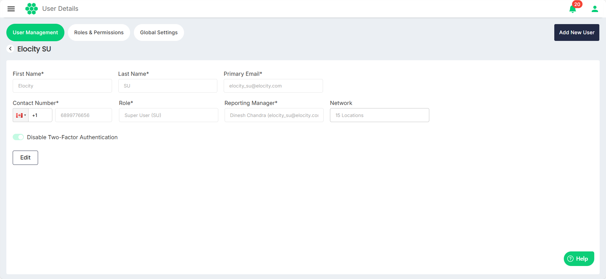
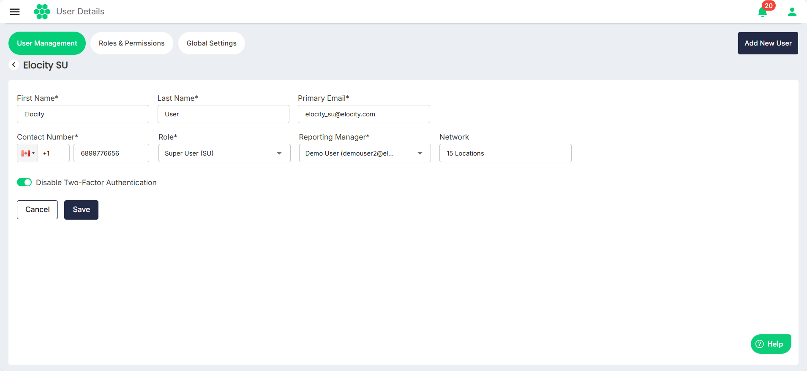

# Editing User

To edit user details, follow these steps:
1. Navigate to **Administration** > **User Management**. The following screen appears, which lists all the existing users:
2. Click anywhere inside a user's record. The Add New User screen appears:
3. Click on the **Edit** button.
4. Make the desired changes.
5. Click **Save**.