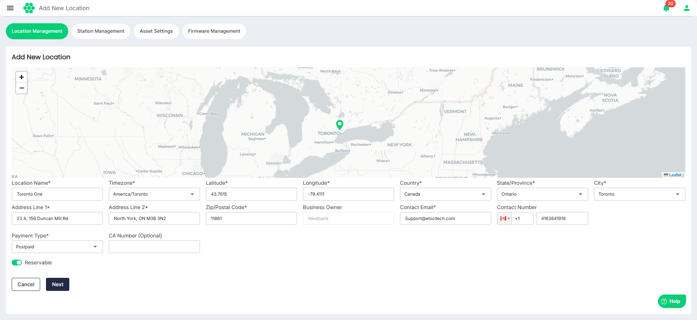
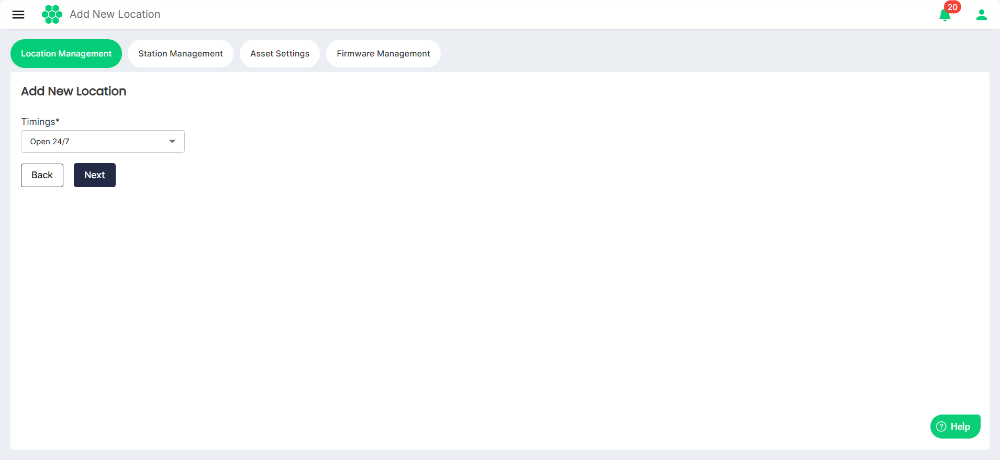
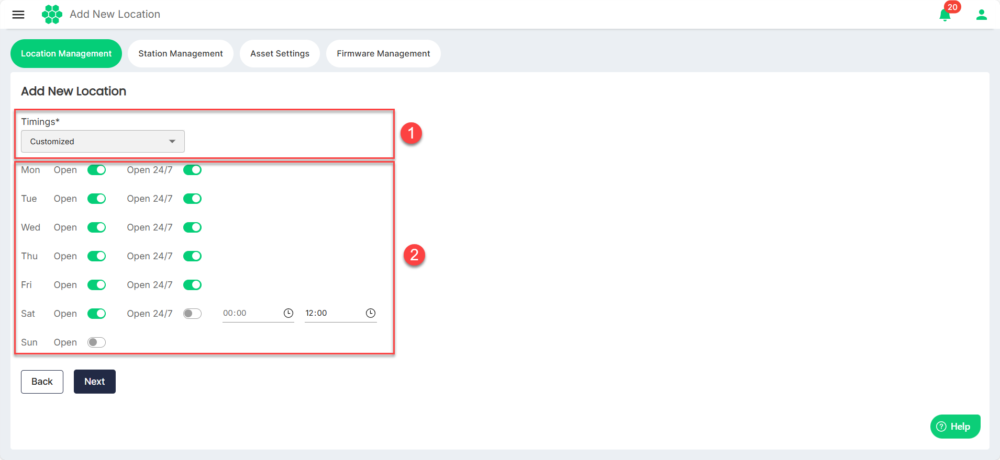
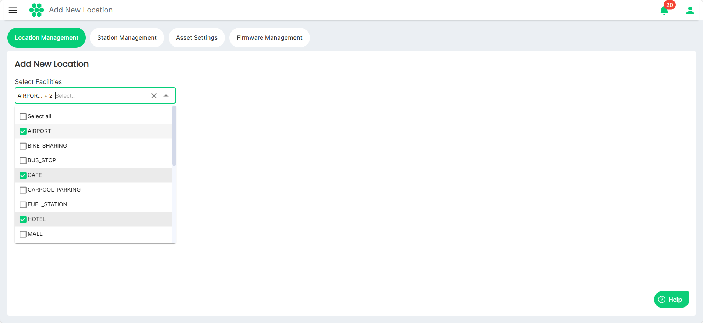

# Adding New Location
Locations refer to physical spaces or venues where new charging stations can be established. These locations play a crucial role in the successful adoption and use of electric vehicles, ensuring convenience, accessibility, and optimal utilization of the charging infrastructure.
:::note
You must add the location before you [**add charging stations**](AddingNewStations).
:::

To add a new location follow these steps:
1. Navigate to **Assets** > **Locations Management**. The following screen appears, which displays a comprehensive list of locations along with the associated details in a tabular format:
2. Click on the **Add New Location** button. The following screen appears:
3. Click and select   (marker icon) and drop it on the map at the new location.
	:::note
	The values in the Latitude and Longitude fields get populated and updated automatically as your move the marker across the map.
	:::
1. Provide values for all the fields marked with an asterisk (*).
2. Turn on the **Reservation** toggle button if you want this location to be reservable.
3. Click **Next**. The following screen appears:
4. Add the timings of operations for the location. Select **Open 24/7** or **Customized** from the Timings drop-down list.
	1. Select **Open 24/7** if you want the location to be operational at all times.
	2. Select **Customized** to set the custom timings of operations for the location.
5. Click **Next**. The following screen appears: 
6. From the **Select Facilities** drop-down list, select the facilities available in the vicinity of the location.
7. Click **Save**.