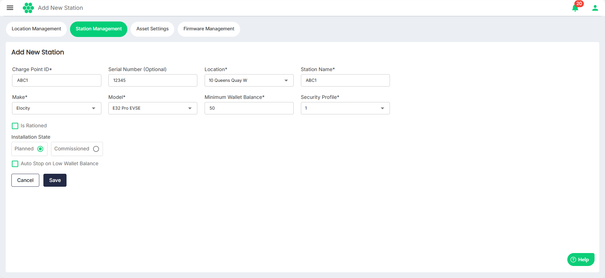

# Adding New Stations
You can add new stations at the existing [locations](ManagingLocations).

1. Navigate to **Assets** > **Station Management**. The following screen appears, which displays a comprehensive list of stations along with the associated details in a tabular format:
2. Click on the **Add New Station** button.
3. Enter the necessary details.
4. Click **Save**.
