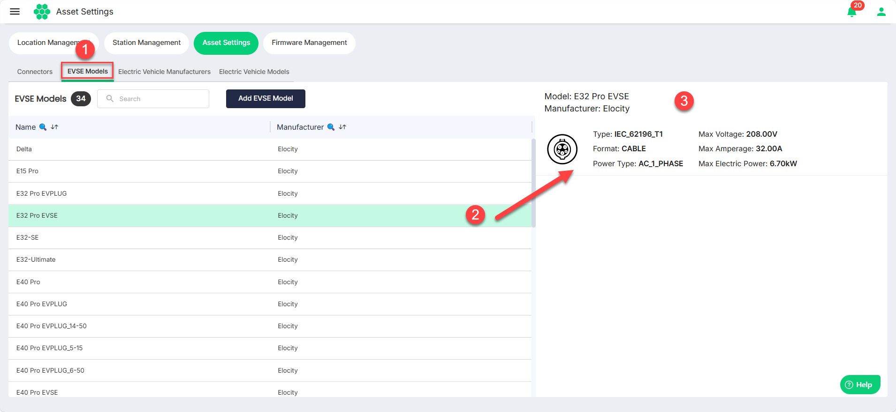
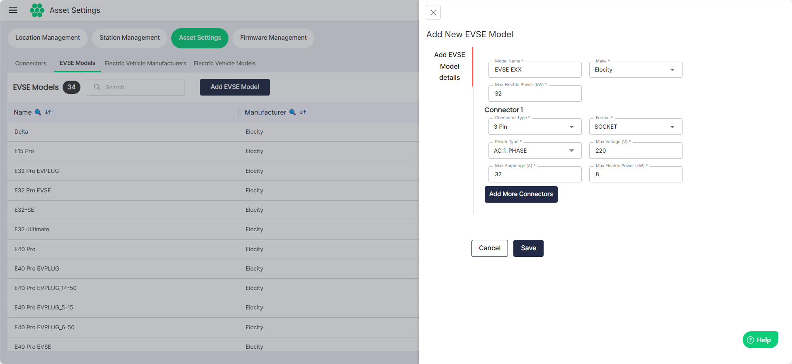

# Managing EVSE Models

To view all the EVSE models:
1. Navigate to **Assets** > **Asset Settings**. 
2. Click on the **EVSE Models** tab. The following screen appears that lists all the available EVSE models.
3. Click inside the row in any record in the **EVSE Models** section on the left to view its details on the right.

## Adding EVSE Model
1. To add a new EVSE model, click on the **Add EVSE Model** button.
2. Enter all the required details. Click the **Add More Connectors** button for the add additional connectors.
3. Click **Save**.