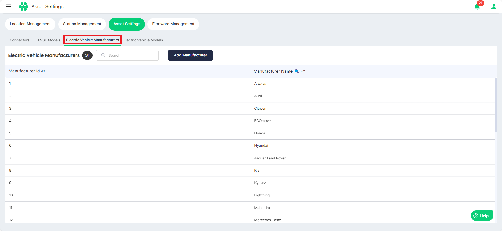
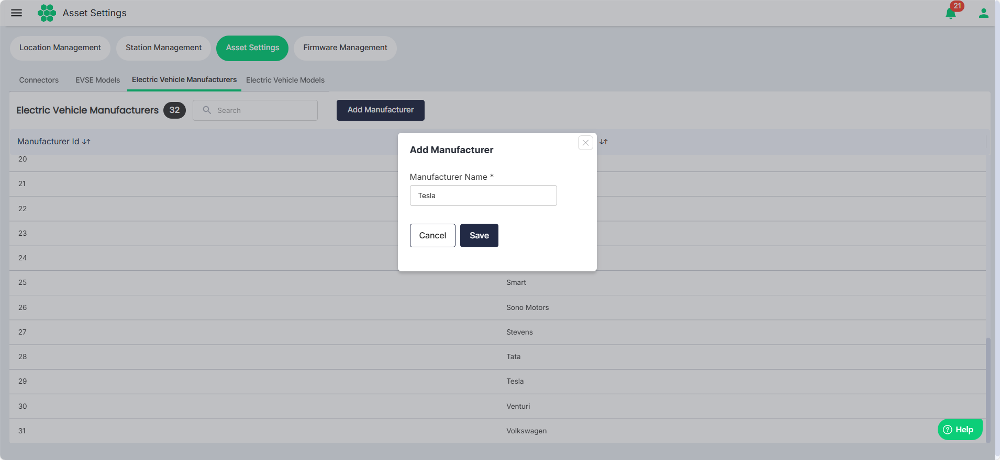

# Managing Electric Vehicle Manufacturers

To view all the Electric Vehicle Manufacturers:
1. Navigate to **Assets** > **Asset Settings**. 
2. Click on the **Electric Vehicle Manufacturers** tab. The following screen appears that lists all the available Electric Vehicle Manufacturers.

## Adding Electric Vehicle Manufacturer
1. To add a new Electric Vehicle Manufacturer, click on the **Add Manufacturer** button.
2. Enter the name of Electric Vehicle Manufacturer.
3. Click **Save**.