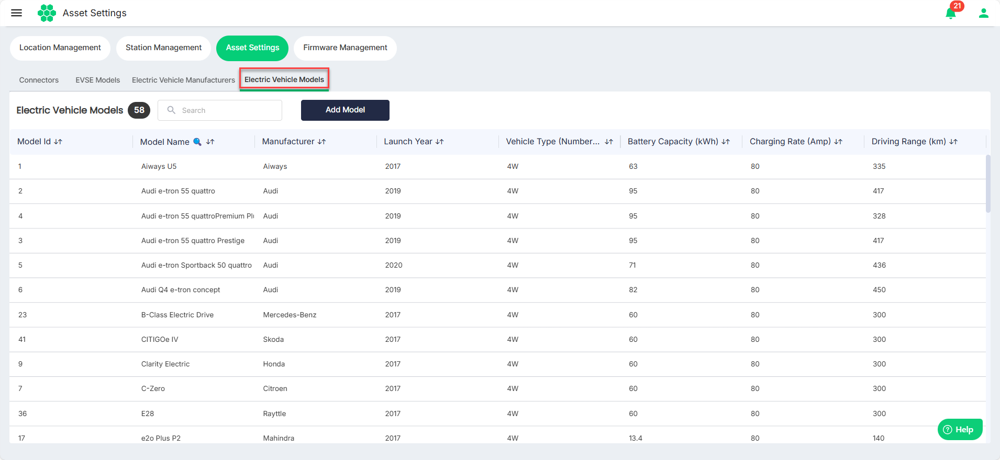
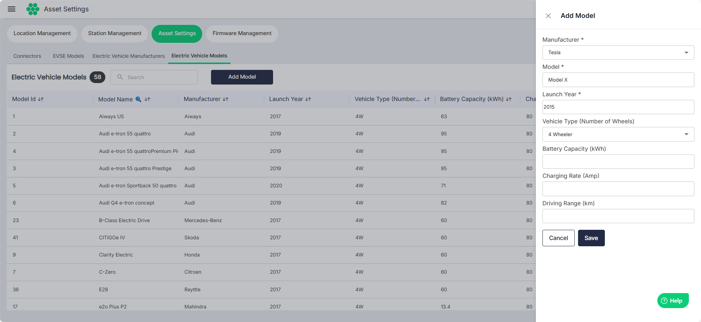

# Managing Electric Vehicle Models

To view all the Electric Vehicle Models:
1. Navigate to **Assets** > **Asset Settings**. 
2. Click on the **Electric Vehicle Models** tab. The following screen appears that lists all the available EVSE models.

## Adding Electric Vehicle Model
1. To add a new Electric Vehicle Model, click on the **Add Model** button.
2. On the **Add Model** screen on the right, enter the details of Electric Vehicle Model.
3. Click **Save**.