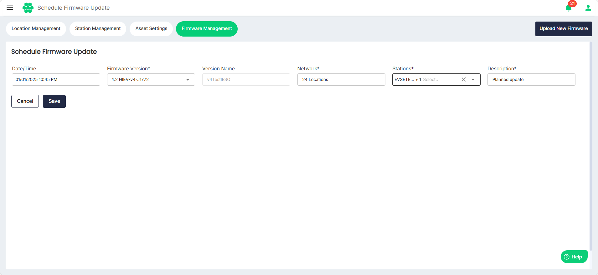

# Scheduling Firmware Updates
Site operators can schedule firmware updates by choosing the firmware file, setting the update time, and selecting the chargers to be updated. Firmware files need to be collected from the manufacturer before scheduling an update.

To schedule a new firmware update:
1. Navigate to **Assets** > **Firmware Management**.
2. Click on the **Schedule Firmware Update** button.
3. Enter all the required details for scheduling the firmware update.
4. Click **Save**.