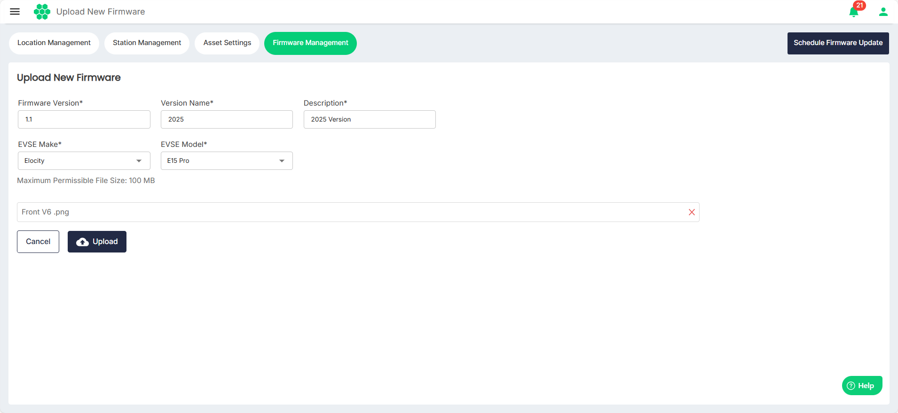

# Uploading New Firmware
Before scheduling an update, users need to upload new firmware file to the web portal, which must be applied to the charge points.

To upload a new firmware update:
1. Navigate to **Assets** > **Firmware Management**.
2. Click on the **Upload New Firmware** button.
3. Enter all the required details for and upload the firmware update.
4. Click **Upload**.