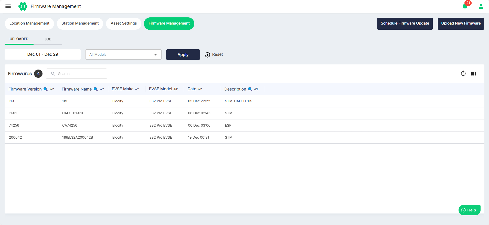
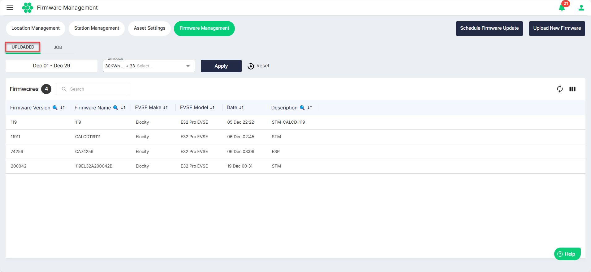
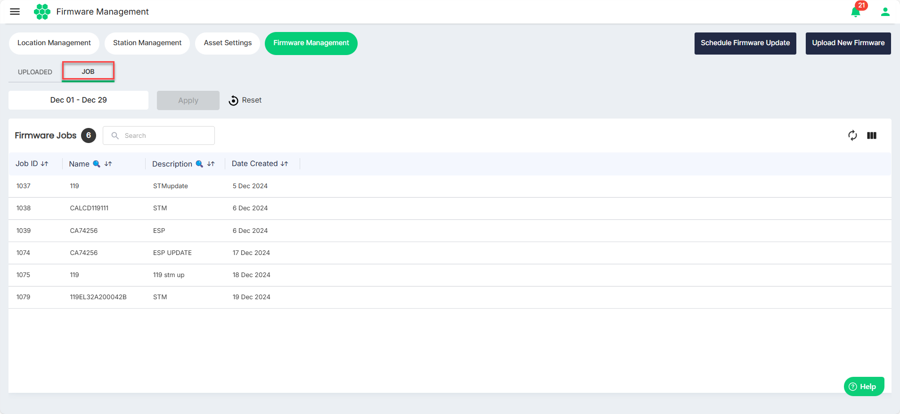

# Viewing Firmware Updates

To view all the firmware updates, navigate to **Assets** > **Firmware Management**. The following list shows all the [uploaded firmware](#viewing-uploaded-firmware) and the [firmware jobs](#viewing-firmware-jobs) under the respective tabs.

## Viewing Uploaded Firmware
To view the list of uploaded firmware, navigate to the **UPLOADED** tab.
Use the **Date** and **All Models** filter to display a limited number of uploaded firmware details.

## Viewing Firmware Jobs
To view the list of firmware jobs, navigate to the **JOB** tab.
Use the **Date** filter to display a limited number of firmware jobs.