# Managing Locations

Every station integrated into the network must be associated with a specific location. Accurate address details, along with latitude and longitude information, are crucial for customer navigation through mobile applications.

Navigate to **Assets** > **Location Management**. The following screen appears, which displays a comprehensive list of locations along with the associated details in a tabular format: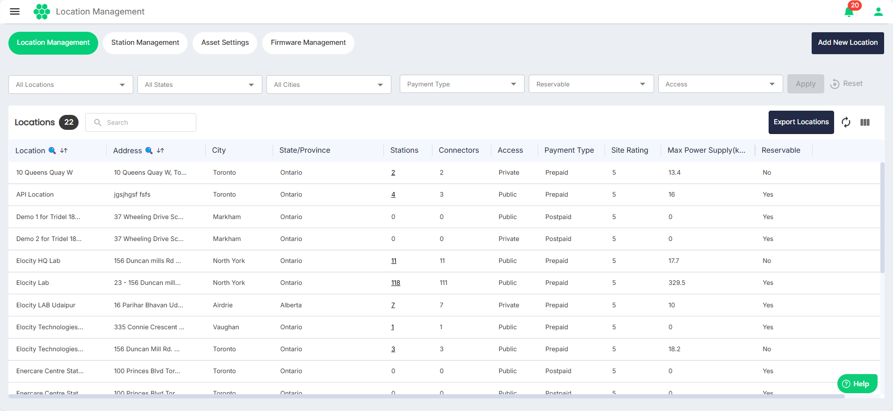

## Filtering Locations
You can filter and view only limited number of locations using the following filters:
- **Locations** - Select one or more locations from the drop-down list.
- **States** - Select one or more states from the drop-down list.
- **Cities** - Select one or more cities from the drop-down list.
- **Payment Type** - Select **Prepaid** or **Postpaid** from the drop-down list.
- **Reservable** - Select **Yes** or **No** from the drop-down list.
- **Access** -  Select **Public** or **Private** from the drop-down list.
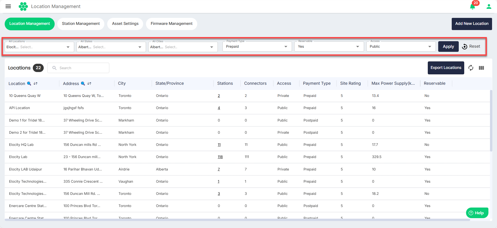

## Exporting Location Details
You can export the location details in a .CSV format for offline viewing and analysis. To do so, click on the **Export Locations** button. 
## Viewing and Managing Location Details
Click anywhere inside a location record row. The following screen appears where you can view and manage the details for the selected location: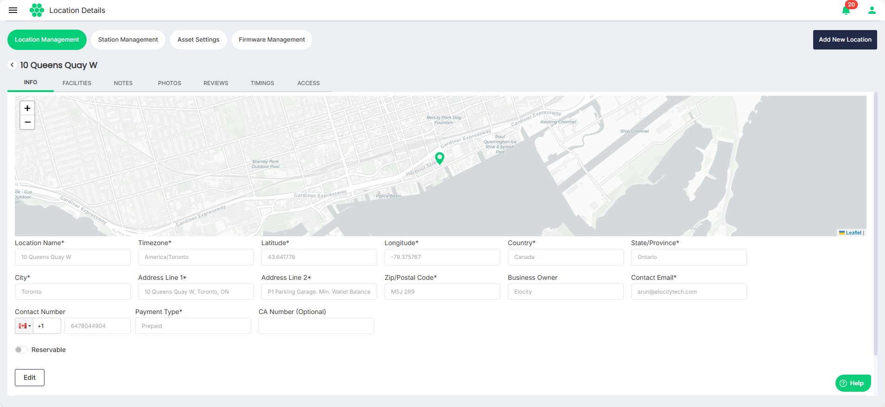

### Managing Info
Click on the **Info** tab. The screen displays the basic details associated with the location: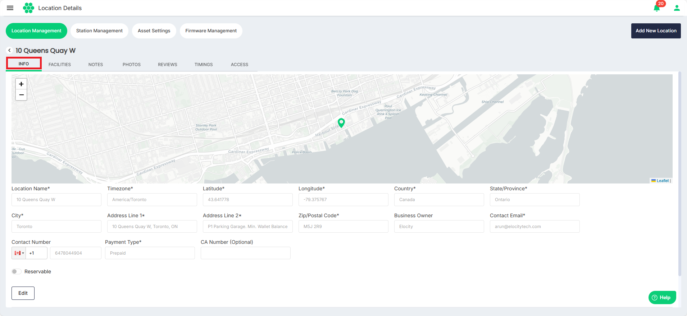

To edit the location details, click on the **Edit** button, make the desired changes, and click the **Save** button.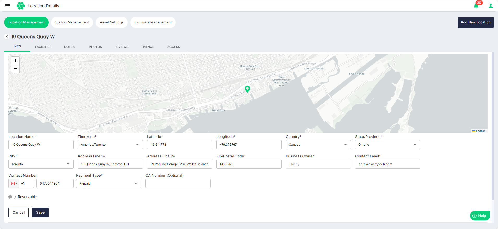

### Managing Facilities
Click on the **Facilities** tab. The screen displays the facilities associated with the location: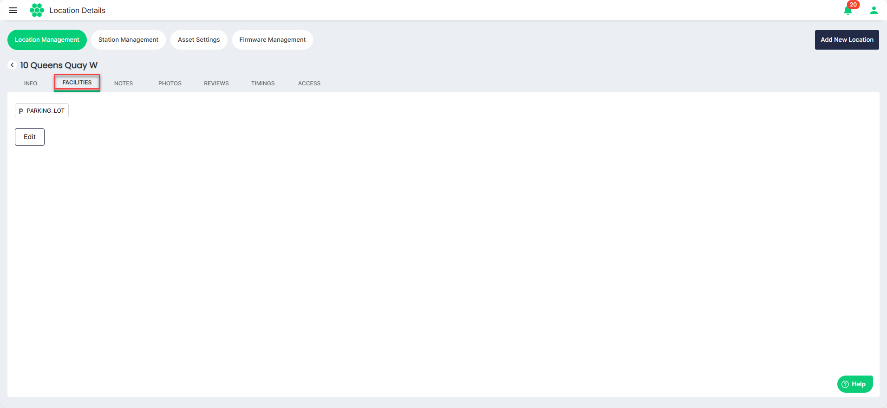

To edit the facilities, click on the **Edit** button, select all the facilities associated with the location from the Select Facilities drop-down list, and click the **Save** button.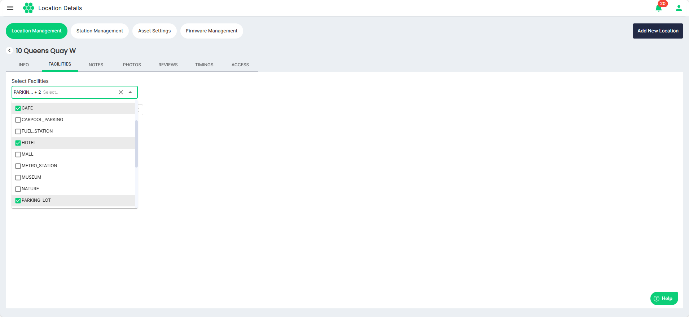

### Managing Notes
Click on the **Notes** tab. The screen displays the notes associated with the location: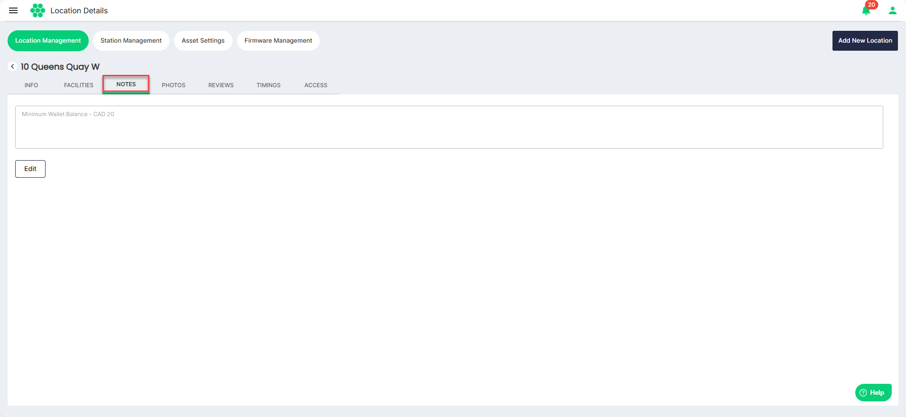

To edit the notes, click on the **Edit** button, make the desired changes to the notes, and click the **Save** button.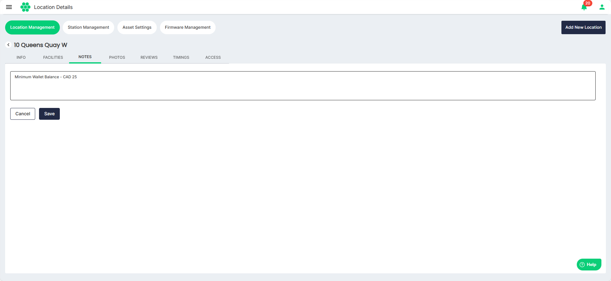

### Managing Photos
Click on the **Photos** tab. The screen displays the photos associated with the location: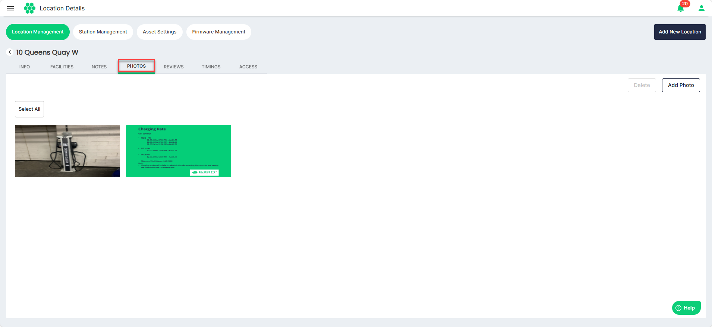

To delete photos, select the photos, or click the **Select All** button to select all the photos at once. Then, click on the **Delete** button.  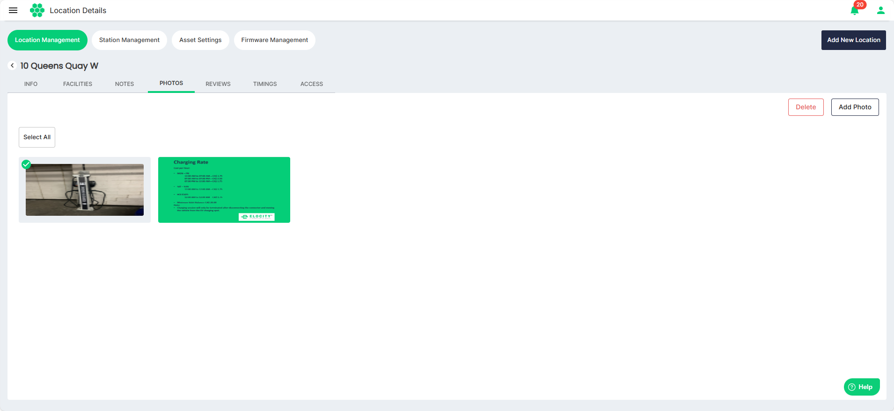

To upload photos, click the **Add Photo** button. The following screen appears from where you can add more photos from your device.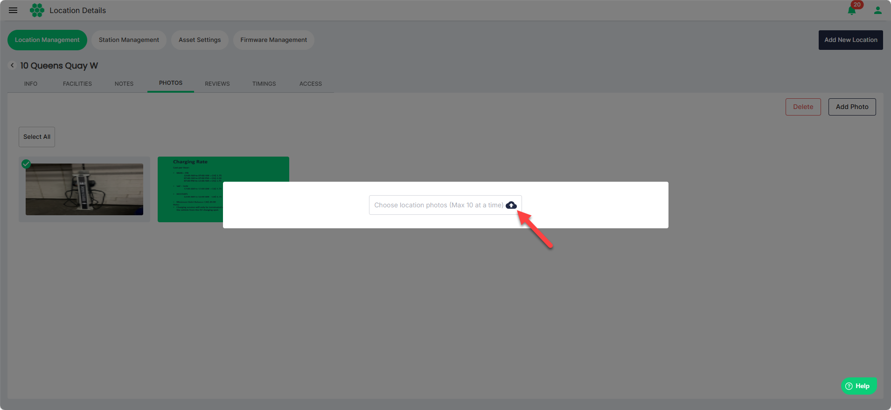

### Viewing Reviews
Click on the **Reviews** tab. The screen displays reviews provided by the customers: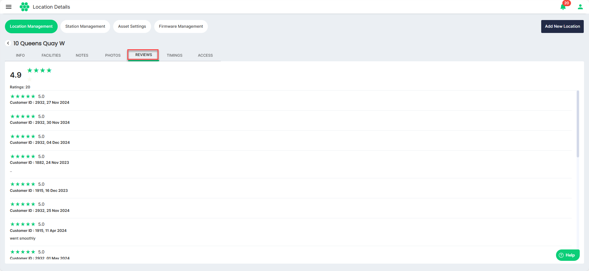

### Managing Timings
Click on the **Timings** tab. The screen displays the operational timings associated with the location: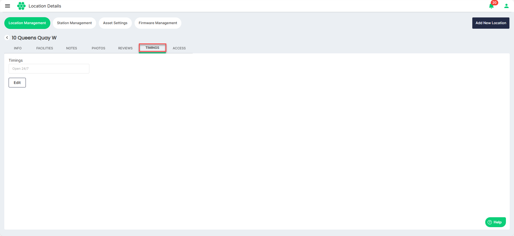
To edit the timings, follow these steps: 
1. Click on the **Edit** button. 
2. Select **Open 24/7** or **Customized** from the Timings drop-down list.
	1. Select **Open 24/7** if you want the location to be operational at all times.
	2. Select **Customized** to set the custom timings of operations for the location.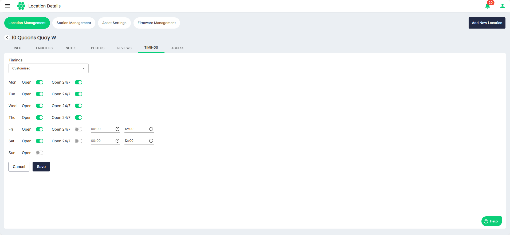
4. Click the **Save** button.