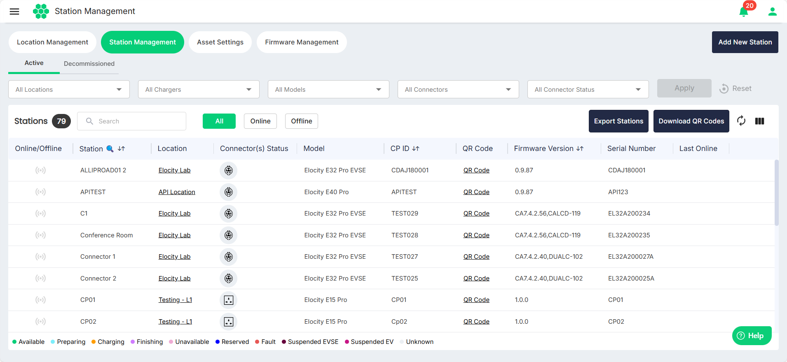
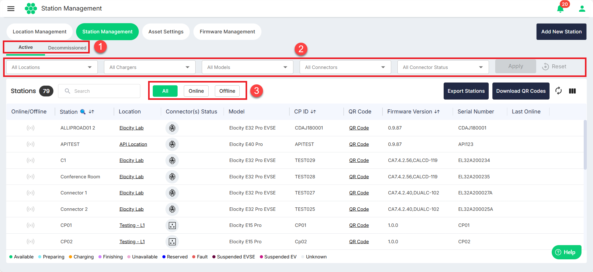
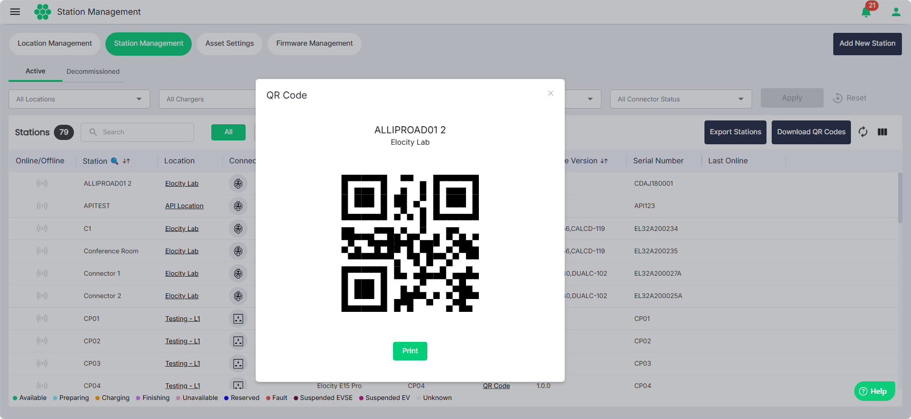
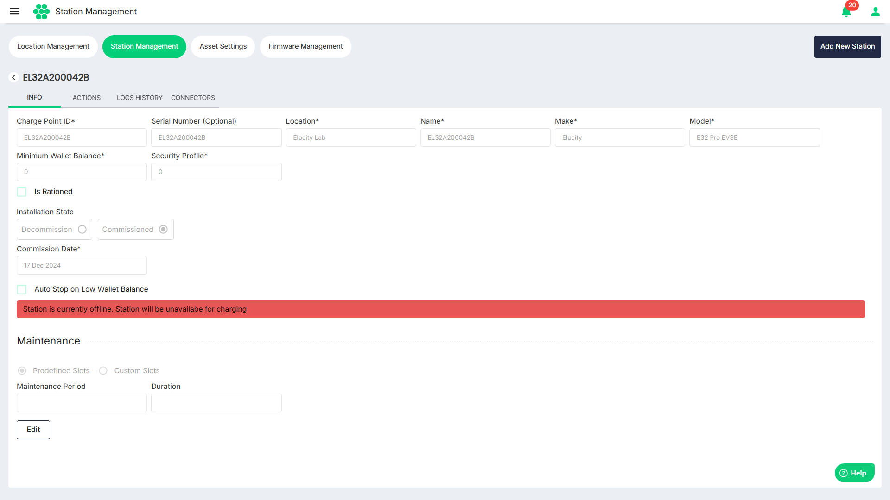
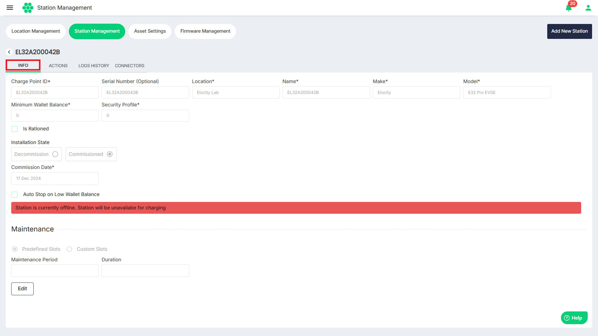
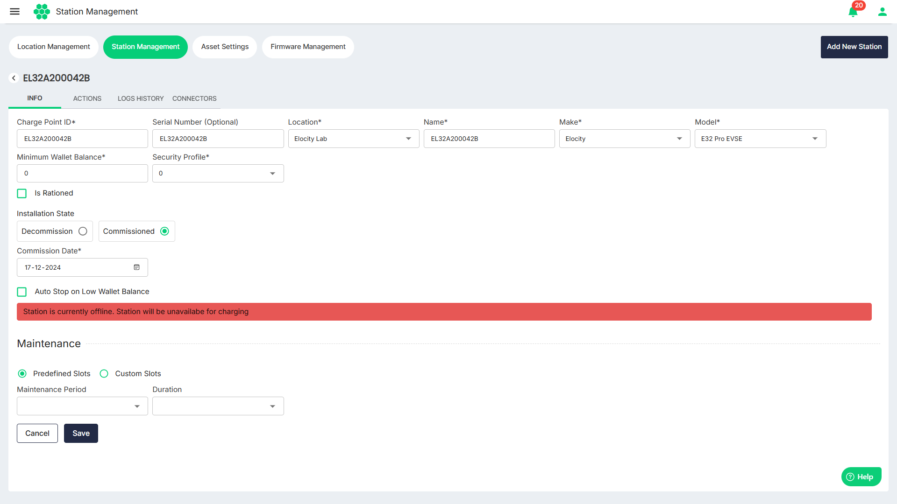
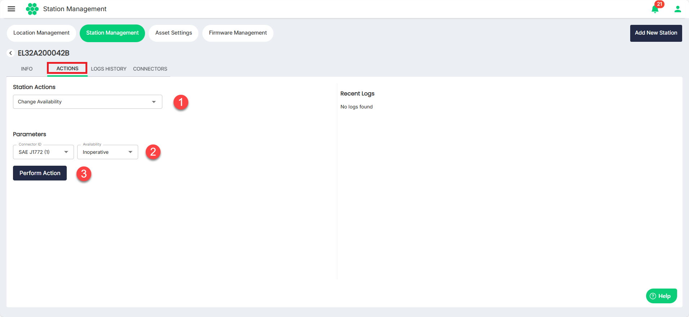
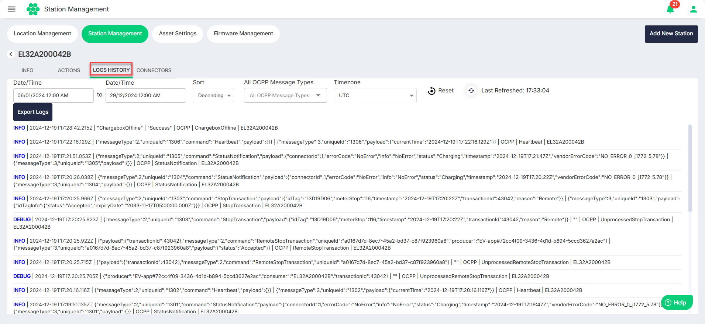
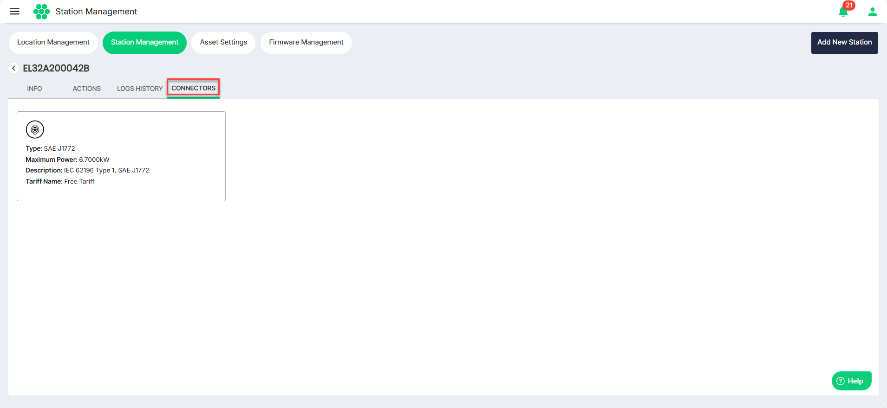

# Managing Stations

Stations refer to the charging points or hubs for electric vehicles (EVs). These stations are part of Elocity's ecosystem, providing charging infrastructure for EVs.

This section covers all station-related activities, allowing you to modify existing station details and perform various tasks related to charging stations. If any modification or addition is needed for an existing station, you can seamlessly navigate through the dashboard.

Navigate to **Assets** > **Station Management**. The following screen appears, which displays a comprehensive list of stations along with the associated details in a tabular format:

## Filtering Stations
1. Click on **Active**/**Decommissioned** tabs to view the respective stations.
2. You can filter and view only limited number of stations using the following filters:
	- **Locations** - Select one or more locations from the drop-down list.
	- **Chargers** - Select one or more states from the drop-down list.
	- **Models** - Select one or more cities from the drop-down list.
	- **Connectors** - Select **Prepaid** or **Postpaid** from the drop-down list.
	- **Connector Status** - Select **Yes** or **No** from the drop-down list.
3. Click on **Add**/**Online**/**Office** buttons to view the respective stations.

## Viewing Location Details
To view the [location details](ManagingLocations) associated with the station, click in the location name in the **Location** column.
## Exporting Station Details
You can export the station details in a .CSV format for offline viewing and analysis. To do so, click on the **Export Stations** button.

## Downloading QR Code Associated with a Station
To download a QR code associated with a station, click on the **QR Code** link in the **QR Code** column. The associated QR code is displayed.
Click on the **Print** button to proceed with printing the QR code.

## Downloading QR Codes in Bulk
You can down station QR codes in bulk. To do so, click on the **Download QR Codes** button. All the QR codes for all the stations will be download in a compresses .ZIP file.

## Viewing and Managing Station Details
Click anywhere inside a station record row. The following screen appears where you can view and manage the details associated with the selected station:

### Managing Info
Click on the **Info** tab. The following screen appears that displays the basic details associated with the station:
The following are important details:
- **Charge Point ID:** This unique identifier facilitates communication between the charger and the web portal.
- **Serial Number:** Serial Number of the charger installed on the field.
- **Location:** Specifies the details of the installation site for the charger.
- **Name:** The designated name displayed to users when searching for the station through the Web portal/mobile application.
- **Make** and **Model:** The accurate selection of make and model is crucial to provide users with precise information about the charger.
- **Minimum Wallet Balance:** This parameter establishes the minimum amount needed in an end user's wallet to initiate a charging session. For example, if set to $50, the system ensures that a minimum balance of $50 is present in the user's application wallet before starting a transaction.

To edit the station details, click on the **Edit** button, make the desired changes, and click the **Save** button.

### Managing Actions
HIEV network follows the OCPP protocol for communication between the Charge Point and the Central System. Users can perform tasks defined in this protocol, ensuring efficient and standardised interactions.

Click on the **Actions** tab. The following screen displays the actions associated with the station:
1. Select the **Station Action** from the drop-down list.
2. Select the **Parameters** associated with the selected Station Action.
3. Click on the **Perform Action**.

Details of frequently used station actions are as follows:
- [Change Availability](#change-availability)
- [Reset Station](#reset-station)
- [Change Configuration](#change-configuration)
- [Clear Cache](#clear-cache)
- [Get Configuration](#get-configuration)
- [Trigger Messages](#trigger-messages)
- [Remote Start Transaction](#remote-start-transaction)
- [Remote Stop Configuration](#remote-stop-transaction)
##### Change Availability
Charge point operator can set the availability of the charger to Operative/Inoperative using this function.
- **Operative:** A station is operative when the charge point is charging or is ready for a new charging session.
- **Inoperative:** A station set inoperative mode, will be no longer be available for charging.
Operator must select the availability mode and click on “Perform action” to implement the changes. Once the change is made, web portal will show a message saying the action was performed successfully.
##### Reset Station
Web portal can request a station to reset itself either via soft reset or hard reset.
- **Soft Reset:** This operation will restart the application software.
- **Hard Reset:** A hard reset can be performed as last option to fix a misbehaving charger. This will restart the hardware.
##### Change Configuration
Select **Change Configuration** for configuration change requests can be effortlessly initiated from the HIEV CPMS, providing CPOs with the flexibility to choose from predefined keys or enter custom keys for modification. Follow these steps to initiate a configuration change:
- **Key Type:** CPOs have the option to either choose from a list of predefined configuration keys or enter a custom key for modification.
- **Configuration Key:** If opting for predefined keys, select the specific configuration parameter from the provided list. Alternatively, CPOs can enter a custom key by selecting the custom key option if the desired configuration parameter is not available in the predefined list.
- **Value:** Input the new value in the Value box

Click on **Perform Action** to send the request. Once the changes are made CPMS will the status as **Success**.

##### Clear Cache
The Clear Cache command can be sent to a Charge Point to reset or clear the authorization cache in the device.

##### Get Configuration
CPOs can conveniently review the configuration settings on a device by selecting the desired configuration key and clicking **Perform Action**.

##### Trigger Messages
Trigger messages can be used to request the device for messages instead of waiting for the scheduled interval. This helps in monitoring and diagnosing the devices more effectively.

##### Remote Start Transaction
CPOs can start a charging session from he CPMS using this feature. Normally the electric vehicle users can initiate a charging session using RFID card or by using mobile application. However, this feature provides an additional option for the CPOs.

:::note
An ID Tag associated with a customer is required to initiate a charging session.
:::
##### Remote Stop Transaction
If a scenario arises, CPOs can also stop any ongoing transaction remotely from the HIEV CPMS.
### Managing Logs History
Logs History provides a comprehensive overview of all communication logs between the charge point and the central system. Users can filter logs by date to evaluate scenarios and ensure proper communication between the charger and the server. You can view and export the systems logs associated with the selected station. 

Click on the **Logs History** tab. The following screen displays the system logs.

To filter the system logs, use the following filters:
	- **Start Date/Time**
	- **End Date/Time**
	- **Sort**
	- **All OCPP Message Types**
	- **Timezone**

To download the displayed logs in a .CSV format, click on the the **Export Logs** button.
### Managing Connectors
Click on the **Connectors** tab. The following screen appears that shows the connectors available at the selected station:

