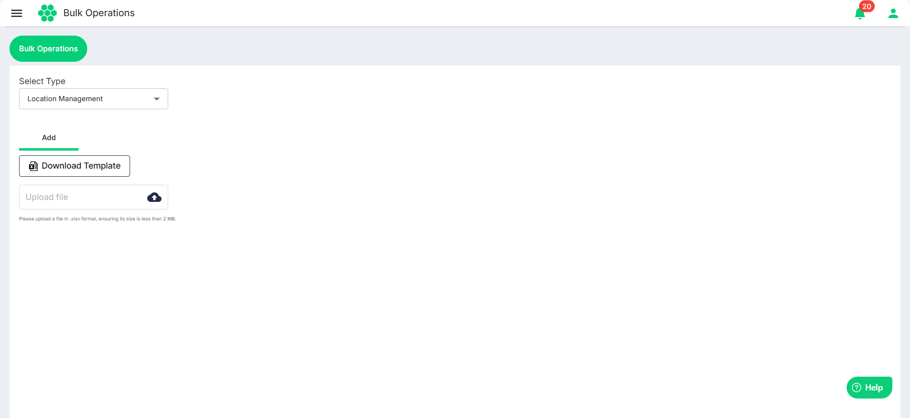
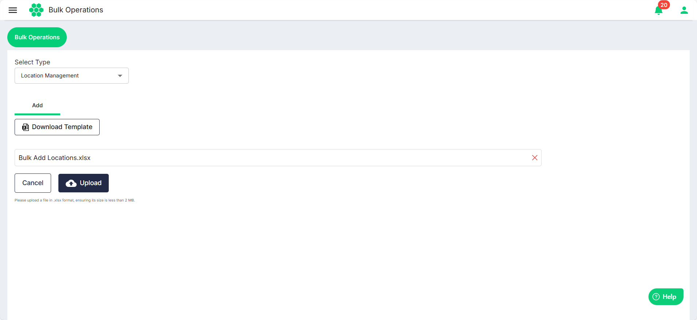

# Location Management

The Elocity web app simplifies location management by allowing admins to seamlessly add and edit multiple locations at once for their EV charging infrastructure from a centralized dashboard.
1. Navigate to **Bulk Operations** > **Bulk Operations**. The following screen appears:
2. Click on the **Download Template** button to download the template file in a .xlsx format. 
3. Enter the locations and the associated details in the downloaded .xlsx file.
4. Click the **Upload file** button to select the updated .xlsx file.
5. Click **Upload**.