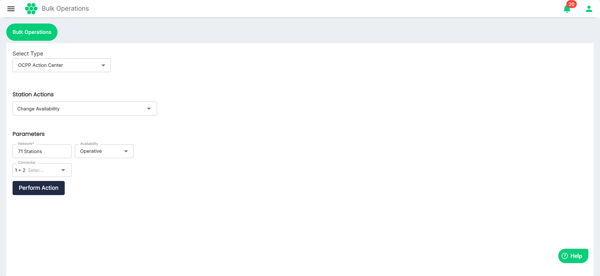
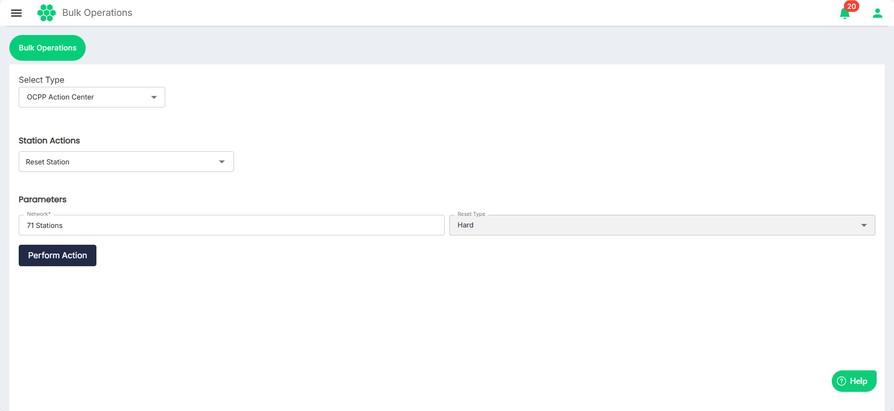
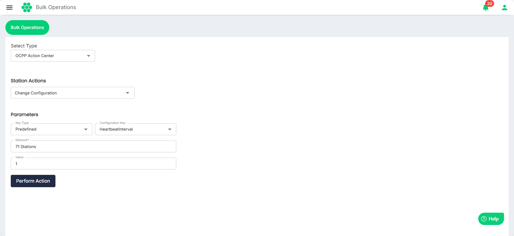
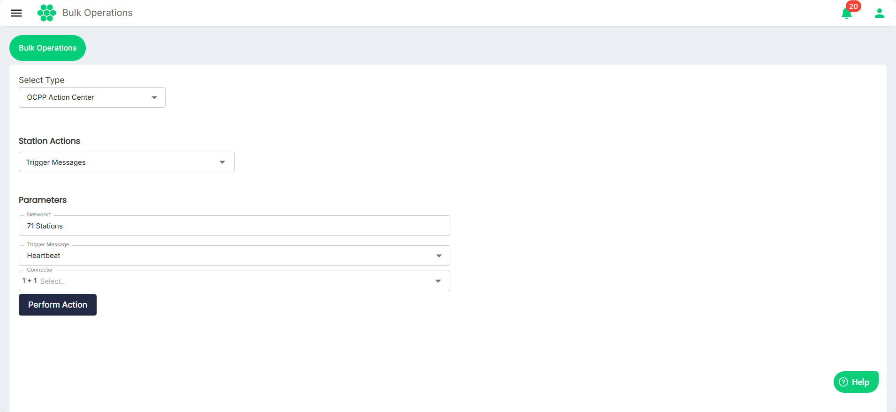

# OCPP Action Center
The Open Charge Point Protocol (OCPP) is an open-source communication standard that allows electric vehicle (EV) charging stations and charging station networks to communicate with each other.

As part of the OCPP Action Center, you can perform the following tasks:
	- Change Availability
	- Reset Station
	- Change Configuration
	- Trigger Messages
1. Navigate to **Bulk Operations** > **Bulk Operations**. The following screen appears:
2. Select **OCPP Action Center** from the **Select Type** drop-down list.
3. Select the option from the **Station Actions** drop-down list. The following options are available:
	- **[Change Availability](#change-availability)**
	- [**Reset Station**](#reset-station)
	- **[Change Configuration](#change-configuration)**
	- **[Trigger Messages](#trigger-messages)**
## Change Availability
To change the availability of the network, follow these steps:
1. Select **Change Availability** from the **Station Actions** drop-down list, the following screen appears: 
2.  Specify the following parameters:
	- **Network*** (Mandatory)
	- **Availability**
	- **Connector**
1. Click **Perform Action**.

## Reset Station
To reset the stations, follow these steps:
1. Select **Change Availability** from the **Station Actions** drop-down list, the following screen appears: 
2. Select the stations you want to reset from the **Network** drop-down list.
3. Select the **Hard**/**Soft** as the reset type from the **Reset Type** drop-down list.
4. Click **Perform Action**.
## Change Configuration
To change the configurations, follow these steps:
1. Select **Change Configuration** from the **Station Actions** drop-down list, the following screen appears: 
2. Select the following parameters:
	- **Key Type**
	- **Configuration Key**
	- **Network**
1. Enter the **Value**.
2. Click **Perform Action**.

## Trigger Messages
To trigger messages, follow these steps:
1. Select **Trigger Messages** from the **Station Actions** drop-down list, the following screen appears: 
2. Select the following parameters:
	- **Network**
	- **Trigger Message**
	- **Connector**
1. Click **Perform Action**.
