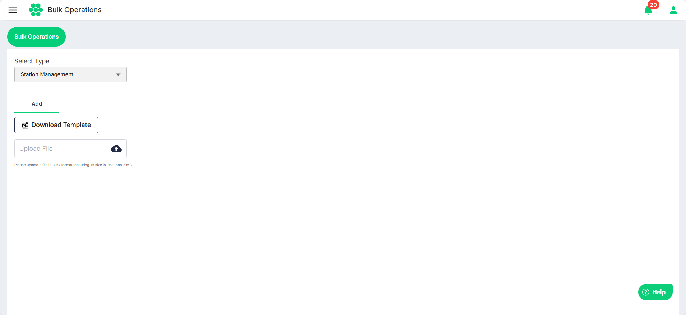
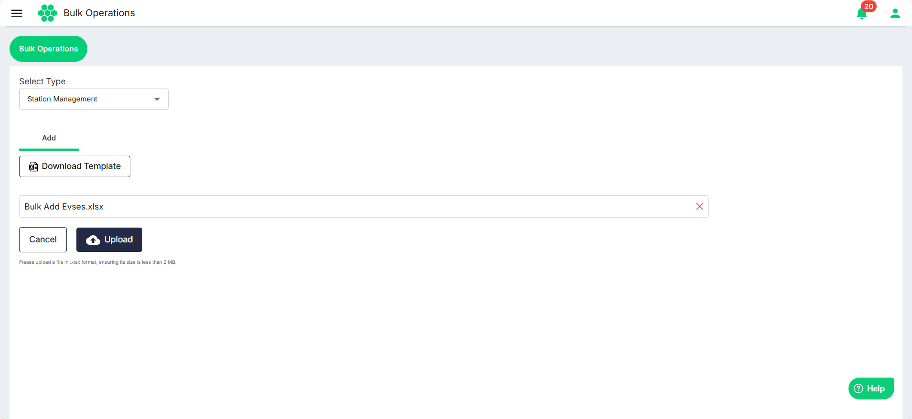

# Station Management

The Elocity web app simplifies station management by allowing admins to seamlessly add and edit multiple stations at once for their EV charging infrastructure from a centralized dashboard.
1. Navigate to **Bulk Operations** > **Bulk Operations**. The following screen appears:
2. Select **Station Management** from the **Select Type** drop-down list.
3. Click on the **Download Template** button to download the template file in a .xlsx format. 
4. Enter the stations and the associated details in the downloaded .xlsx file.
5. Click the **Upload file** button to select the updated .xlsx file.
6. Click **Upload**.