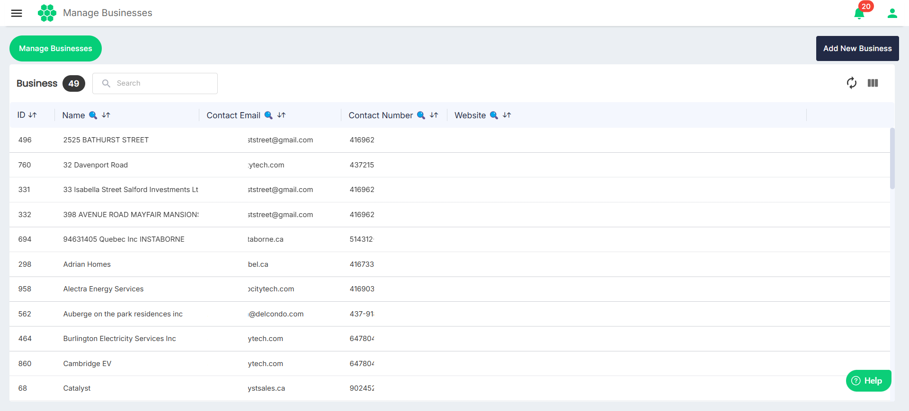
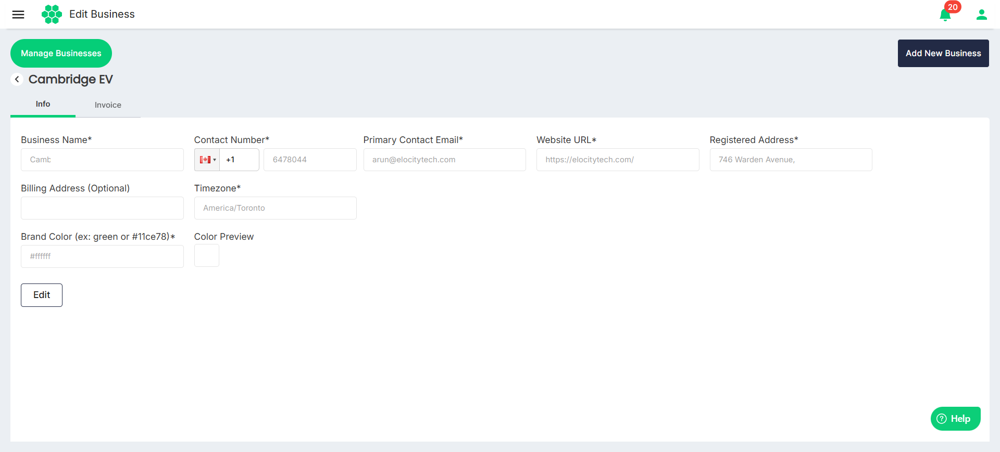
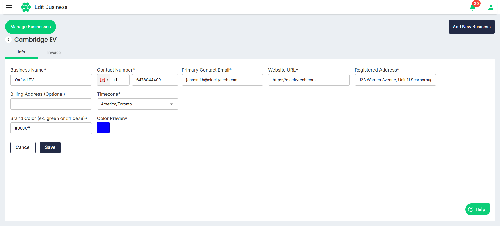
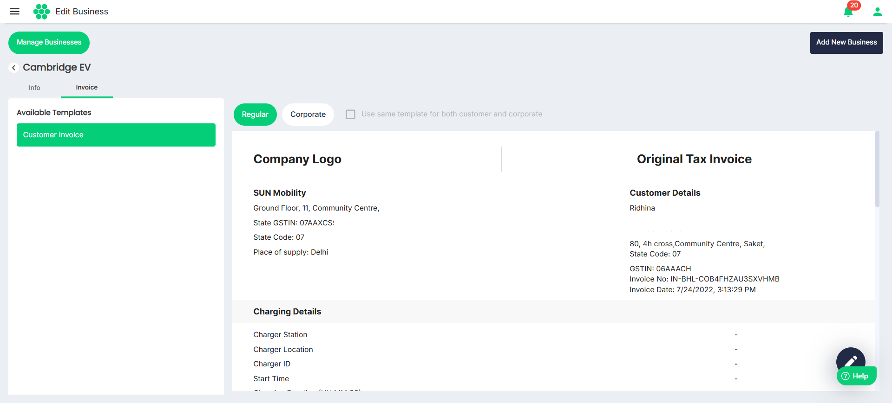

# Managing a Business
As part of managing a business, you can perform the following tasks:
- [Viewing a Business](#viewing-a-business)
- [Editing a Business](#editing-a-business)
## Viewing Business Details
To view a business, follow these steps:
1. Navigate to **Business** > **Manage Businesses**. The following screen appears that lists all the businesses registered in the system.
2. To view the details associated with a business, click anywhere inside the business record you want to view. The following screen appears that shows the details of the business.

## Editing Business Details
To edit business details:
1. Navigate to **Business** > **Manage Businesses**. The following screen appears that lists all the businesses registered in the system.
2. Click anywhere inside the business record you want to edit. The following screen appears that lists the details of the business under the Info tab:
3. Click **Edit**. The following screen appears:
4. Click **Save**.

## Managing Invoice Templates
1. Navigate to **Business** > **Manage Businesses**. The following screen appears that lists all the businesses registered in the system.
2. Click anywhere inside the business record you want to edit. The following screen appears that lists the details of the business under the Info tab:
3. Click on the **Invoice** tab. The following screen appears that shows the **Regular** and **Corporate** invoice templates under the respective sections:
4. To edit an invoice template, click on the **pencil** icon to make desired changes to the invoice template.
