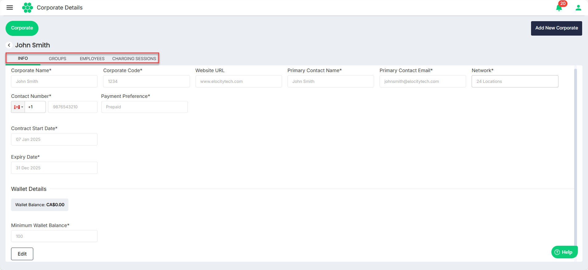
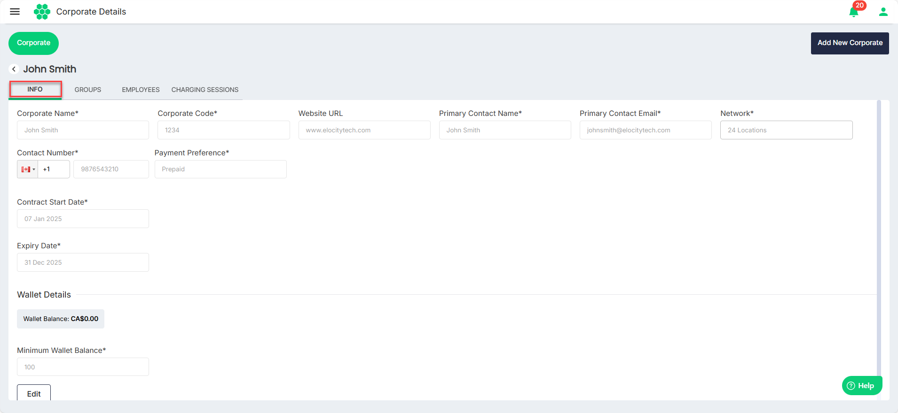
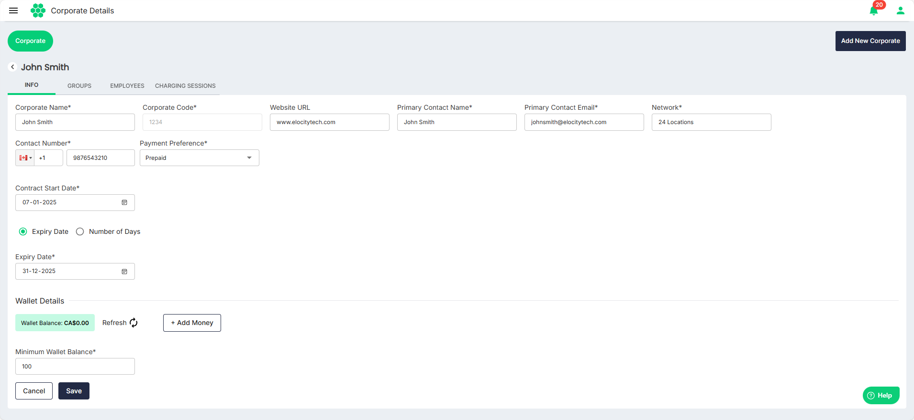

# Managing Corporate
As part of managing corporate, you can perform the following tasks:
- [Viewing Corporates](#viewing-corporates)
- [Editing Corporates](#editing-corporates)
## Viewing Corporates
To view all the corporates, navigate to **Corporate** > **Corporate**. The Corporate List screen appears.
The Corporate List screen displays all the businesses with which the CPO has established relationships. You can view key details such as:
- **Name**: Name of the business
- **Corporate Code**: Code assigned to the business
- **Contact Name**: Name of the business’s primary contact person
- **Contact Email**: Email address of the primary contact
- **Contact Number**: Phone number of the business
- **Contract Start Date**: Start date of the contract
- **Contract Expiry Date**: Expiry date of the contract
- **Status**: Active/Expired status of the corporate

To view the details associated with a corporate, click anywhere inside the record row of the corporate that you want to view. The following screen appears:The screen lists various details associated with the selected corporate under the following tabs:
- [INFO](#editing-corporates)
- [GROUPS](ManagingGroups)
- [EMPLOYEES](ManagingEmployees)
- [CHARGING SESSIONS](ViewingChargingSessions)
## Editing Corporates
To edit the basic details associated with a corporate, follow these steps:
1. Navigate to  to **Corporate** > **Corporate**. The Corporate List screen appears.
2. Click anywhere inside the record row of the corporate that you want to view. The following screen appears that lists all the basic details associated with the selected corporate under the **Info** tab:
3. Click **Edit**. 
4. Make the desired changes.
5. Click **Save**.

