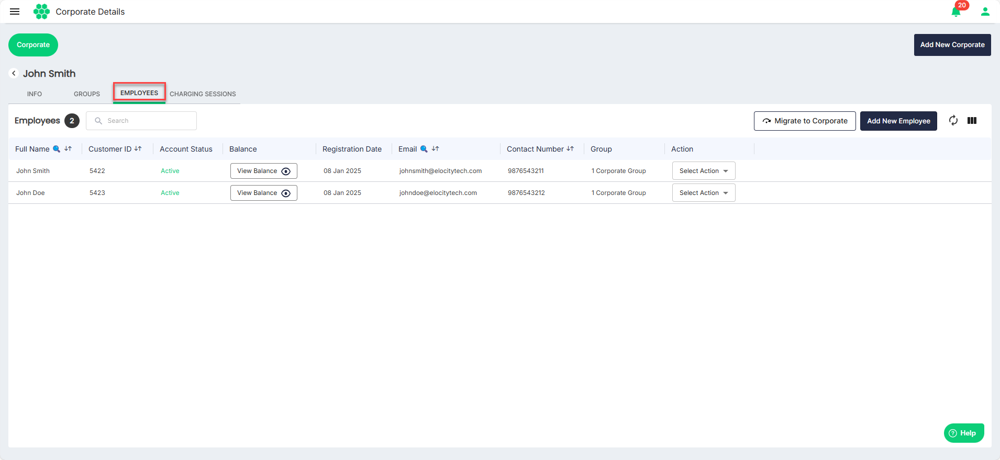
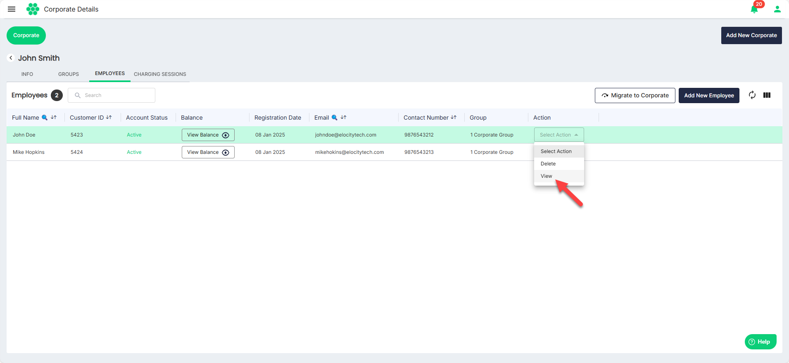
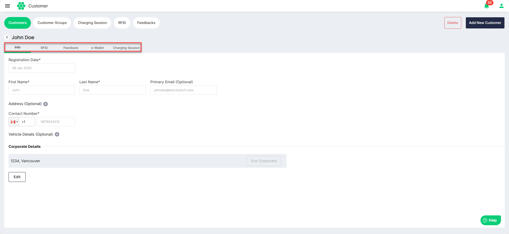
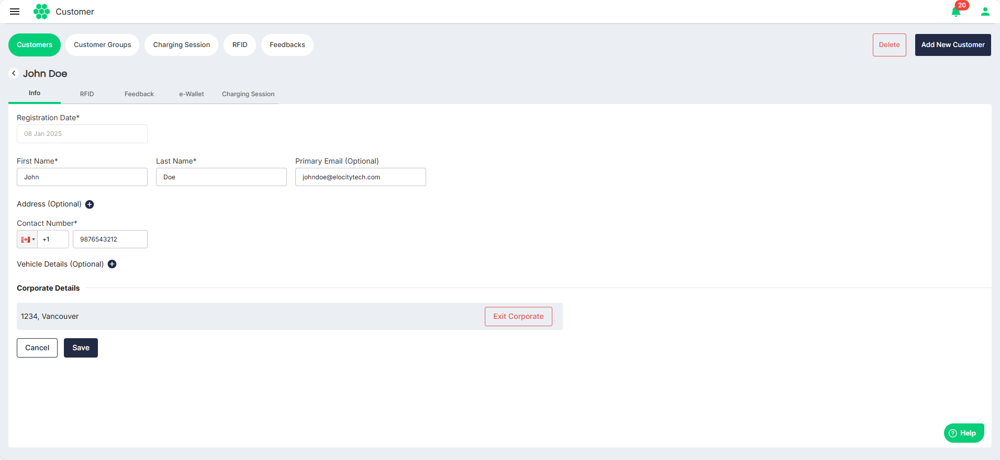
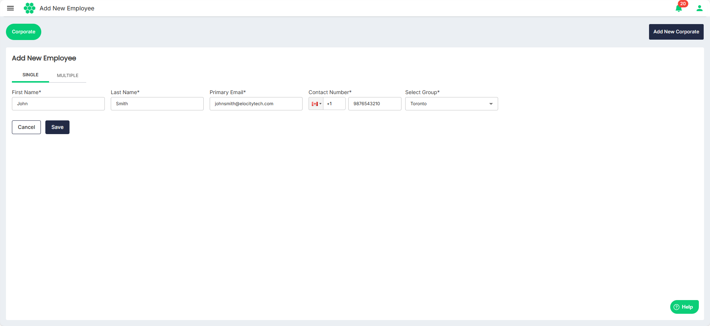
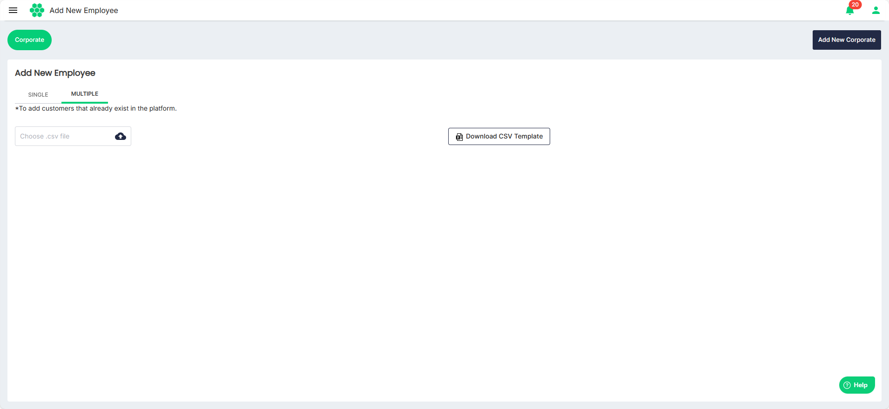
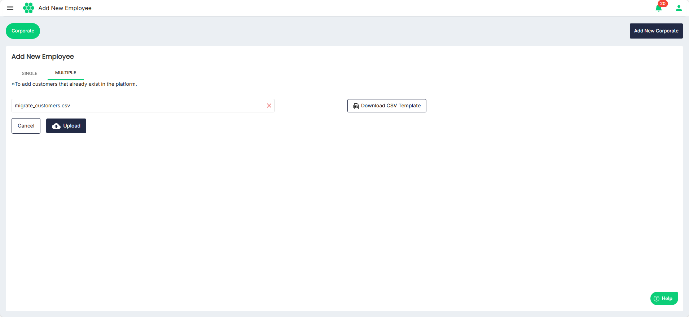
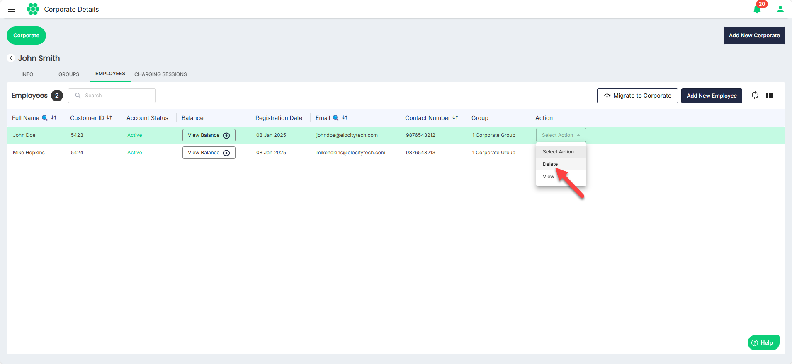

# Managing Employees
As part of managing employees, you can perform the following tasks:
- [Viewing Employees](#viewing-employees)
- [Viewing Employee Details](#viewing-employee-details)
- [Editing Employee Details](#editing-employee-details)
- [Adding Employees](#adding-employees)
- [Deleting an Employee](#deleting-an-employee)
## Viewing Employees
To add a new group, follow these steps:
1. Navigate to **Corporate** > **Corporate**. The Corporate List screen appears.
2. Click anywhere inside the record row of the corporate where you want to add employees. The following screen appears:
3. Click on the **EMPLOYEES** tab. The following screen appears that lists the Employees associated with the corporate:
## Viewing Employee Details
To view the details associated with an employee, follow these steps:
 1. Navigate to **Corporate** > **Corporate**. The Corporate List screen appears.
1. Click anywhere inside the record row of the corporate whose employee details you want to view. The following screen appears:
2. Click on the **EMPLOYEES** tab. The following screen appears that lists the employees associated with the corporate:
3. Select **View** from the **Selection Action** drop-down list. 
The following screen appears where you can view the details associated with an employee categorized under the **Info**, **RFID**, **Feedback**, **e-Wallet**, and **Charging Session** tabs:
## Editing Employee Details
To edit the details associated with an employee, follow these steps:
 1. Navigate to **Corporate** > **Corporate**. The Corporate List screen appears.
1. Click anywhere inside the record row of the corporate whose employee details you want to edit. The following screen appears:
2. Click on the **EMPLOYEES** tab. The following screen appears that lists the Employees associated with the corporate:
3. Select **View** from the **Selection Action** drop-down list. 
4. The following screen appears where you can view the details associated with an employee categorized under the **Info**, **RFID**, **Feedback**, **e-Wallet**, and **Charging Session** tabs:
5. Click **Edit**.
6. Make the desired changes.
7. Click **Save**.

## Adding Employees
To add an employee, follow these steps:
 1. Navigate to **Corporate** > **Corporate**. The Corporate List screen appears.
1. Click anywhere inside the record row of the corporate where you want to add an employee. The following screen appears:
2. Click on the **EMPLOYEES** tab. The following screen appears that lists the Employees associated with the corporate:
3. Click the **Add New Employee** button. The Add New Employee screen appears, which lets you add a single employee or multiple employee at once.
- **Adding Single Employee**: To add a single employee, follow these steps:
	1. Navigate to the **SINGLE** tab.
	2. Enter the **First Name**, **Last Name**, **Primary Email**, and **Contact Number**.
	3. Select the group with which you want to associate the employee from the from the **Select Group** drop-down list.
	4. Click **Save**.
- **Adding Multiple Employees**: To add a multiple employees at once, follow these steps:
	1. Navigate to the **MULTIPLE** tab.
	2. **Download CSV Template**.
	3. Enter the details of all the employees in the CSV file.
	4. Click the **Choose .csv file** button to select the updated CSV file.
	5. Click **Upload**. 
## Deleting an Employee
To delete the an employee, follow these steps:
 1. Navigate to **Corporate** > **Corporate**. The Corporate List screen appears.
1. Click anywhere inside the record row of the corporate whose employee you want to delete. The following screen appears:
2. Click on the **EMPLOYEES** tab. The following screen appears that lists the Employees associated with the corporate:
3. Select **Delete** from the **Selection Action** drop-down list. 

