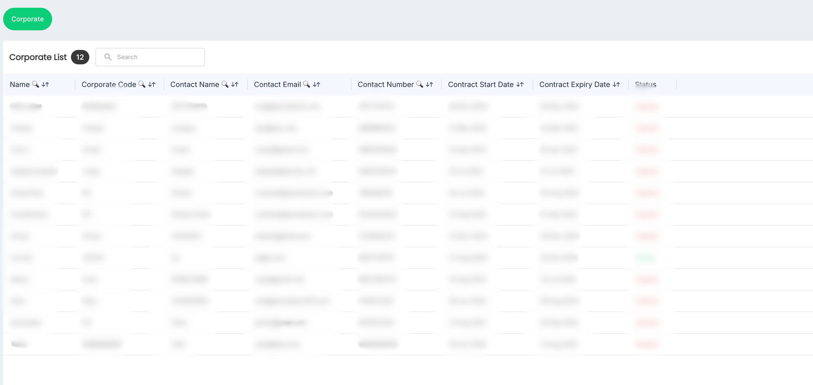
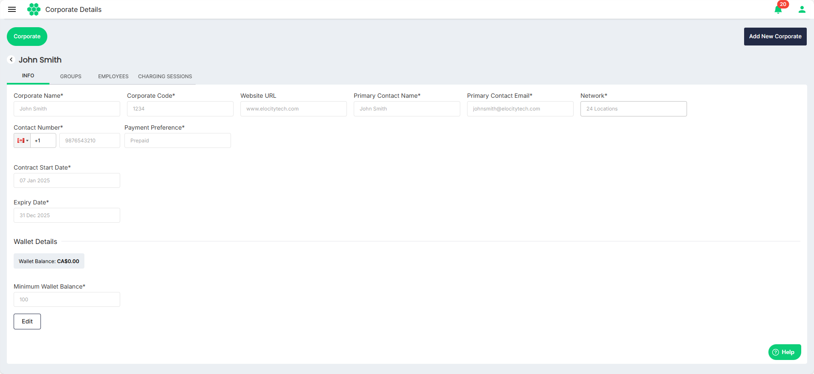
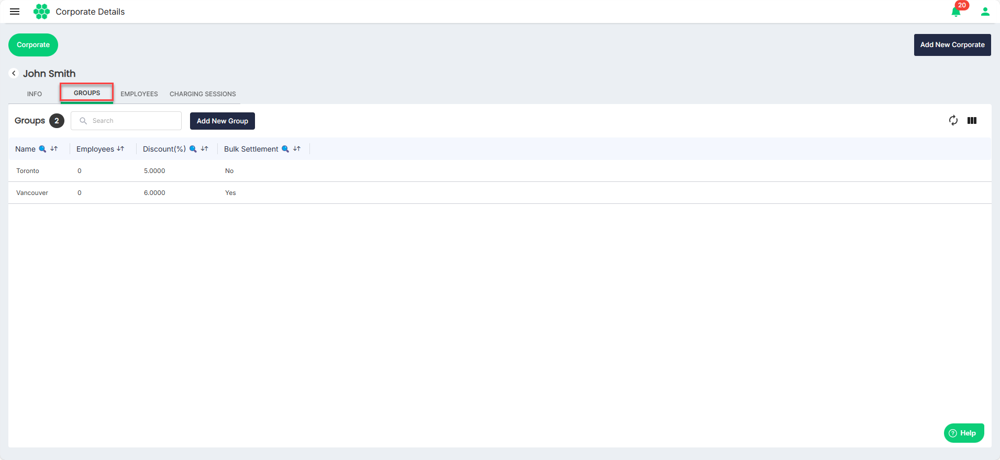
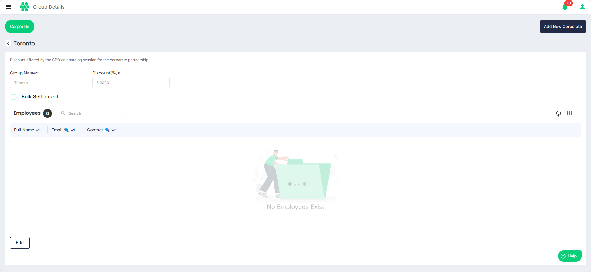
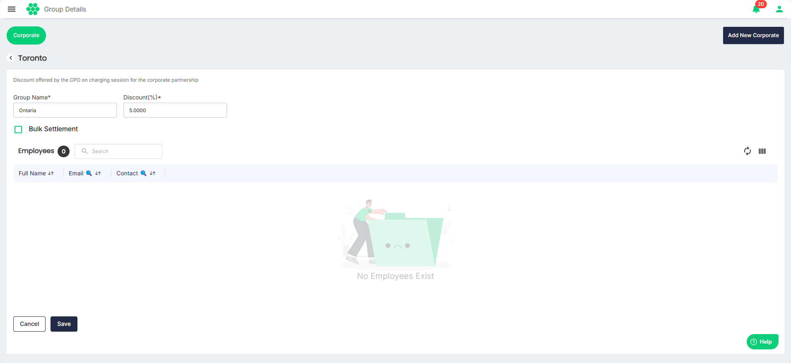
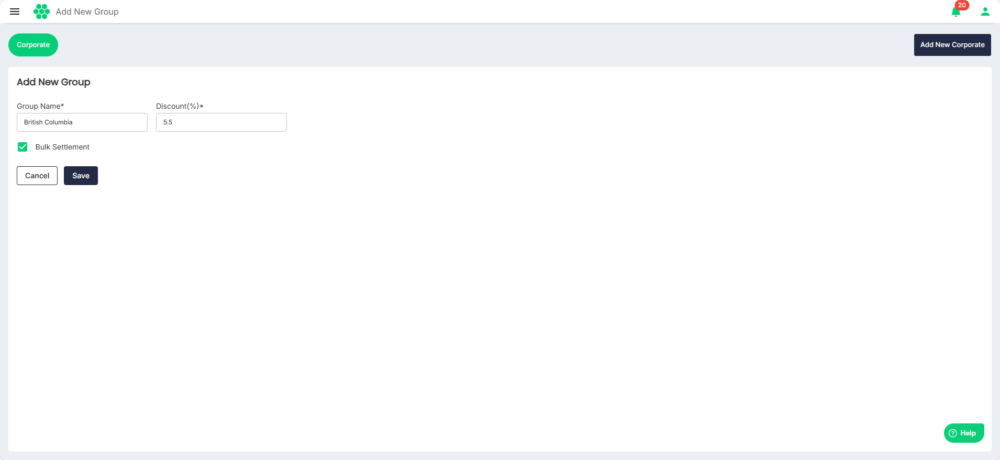

# Managing Groups
CPO users can create new groups to segment business employees and design discount plans. As part of managing groups, you can perform the following tasks:
- [Viewing Group Details](#viewing-group-details)
- [Editing Group Details](#editing-group-details)
- [Adding New Group](#adding-new-group)
## Viewing Group Details
To view all the groups list and the details associated with a group, follow the steps:
1. Navigate to **Corporate** > **Corporate**. The Corporate List screen appears.
2. Click anywhere inside the record row of the corporate that you want to view. The following screen appears:
3. Click on the **GROUPS** tab. The following screen appears that lists the groups associated with the corporate:
4. Click on a group record row to view the details associated with a group. The following screen appears that lists the details associated with the group:
## Editing Group Details
To edit the details associated with a group, follow the steps:
1. Navigate to **Corporate** > **Corporate**. The Corporate List screen appears.
2. Click anywhere inside the record row of the corporate whose group you want to modify. The following screen appears:
3. Click on the **GROUPS** tab. The following screen appears that lists the groups associated with the corporate:
4. Click on a group record row to view the details associated with a group. The following screen appears that lists the details associated with the group:
5. Click **Edit**.
6. Make the desired changes.
7. Click **Save**.

## Adding New Group
To add a new group, follow the steps:
1. Navigate to **Corporate** > **Corporate**. The Corporate List screen appears.
2. Click anywhere inside the record row of the corporate where you want to add a group. The following screen appears:
3. Click on the **GROUPS** tab. The following screen appears that lists the groups associated with the corporate:
4. Click on the **Add New Group** button.
5. Enter the **Group Name** and **Discount (%)**.
6. Select the **Bulk Settlement** option if required.
	- When selected, the business pays for the charging sessions as an offline payment.
	- When unselected, the employees pay for the charging sessions after discounts.
1. Click **Save**.