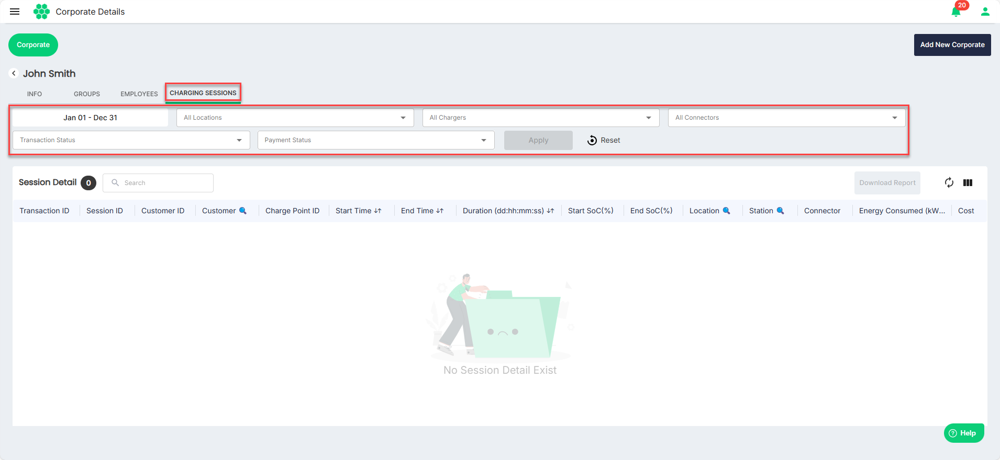

# Viewing Charging Sessions
To view all the charging sessions and the associated details, follow the steps:
1. Navigate to **Corporate** > **Corporate**. The Corporate List screen appears.
2. Click anywhere inside the record row of the corporate for which you want to view the charging sessions. The following screen appears:
3. Click on the **CHARGING SESSIONS** tab. The following screen appears that lists the charging sessions associated with the corporate:
You can use the filters at the top to trim-down the number of results you want to view.

