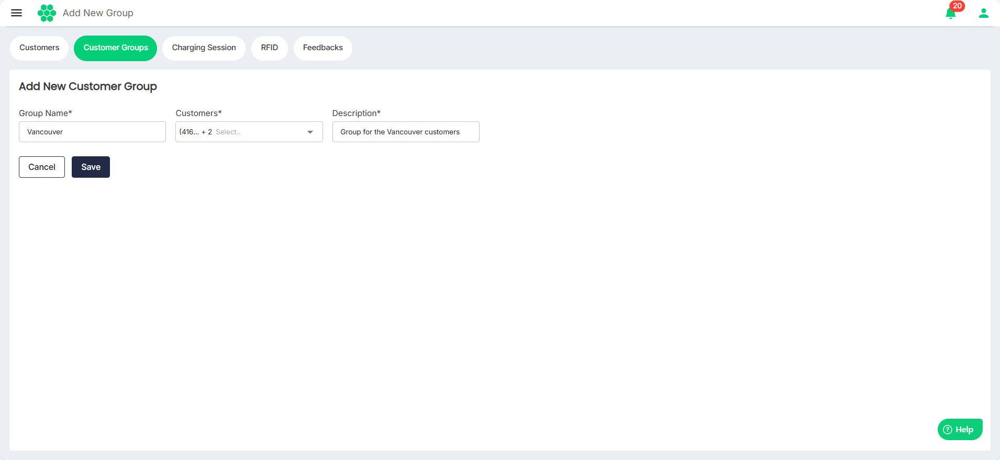

# Adding New Customer Group
To view all the customer groups in the system: follow these steps:
1. Navigate to **Customer** > **Customer Groups**. The following screen appears that displays all the customer groups:
2. Enter the **Group Name** and **Description** and select the customers you want to associate with this group from the **Customers** drop-down list.
3. Click **Save**.

