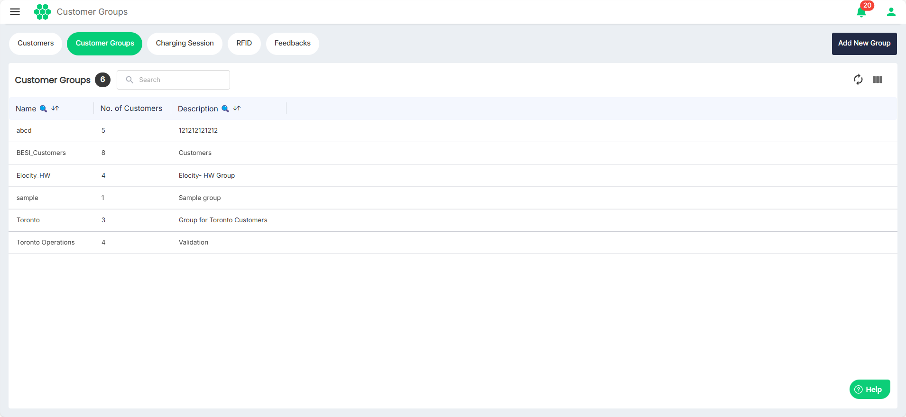
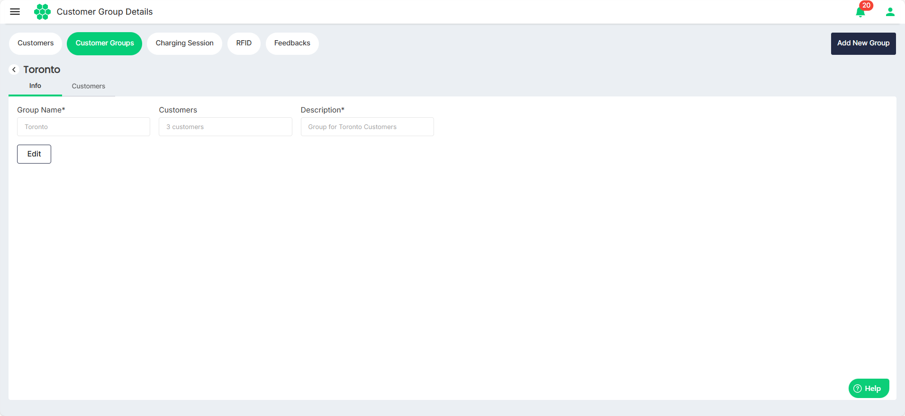
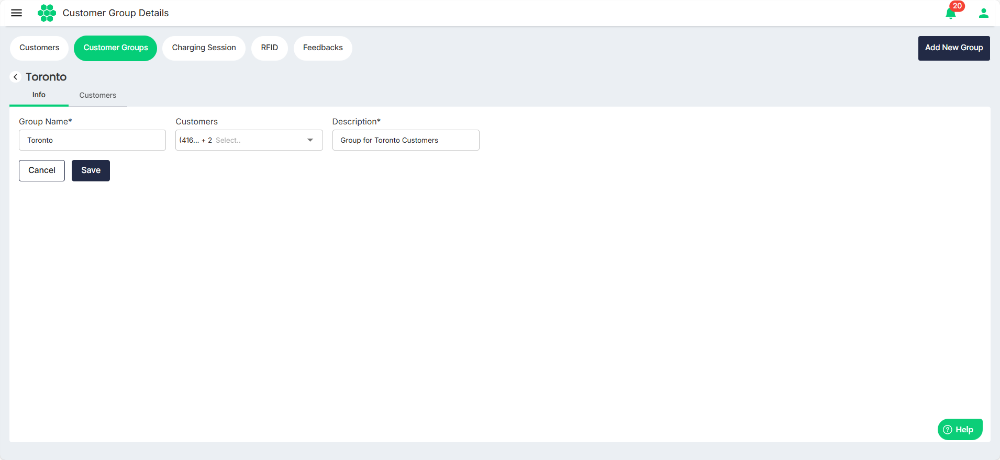

# Managing Customer Groups
As part of managing the customer groups, you can perform the following tasks:
- [Viewing Customer Groups](#viewing-customer-groups)
- [Viewing Customer Group Details](#viewing-customer-group-details)
- [Editing Customer Group](#viewing-customer-groups)

## Viewing Customer Groups
To view all the customer groups in the system, navigate to **Customer** > **Customer Groups**. The following screen appears that displays all the customer groups:

## Viewing Customer Group Details
Click anywhere on the customer group's record that you want to view. The following screen appears that shows all the associated details under the **Info** and **Customers** tabs:
## Editing Customer Group
1. Click on the **Edit** button under the **Info** tab. The following screen appears:
2. Make the desired changes. You can edit the **Group Name** and **Description** and select the customers you want to associate with this group from the **Customers** drop-down list.
3. Click **Save**.
