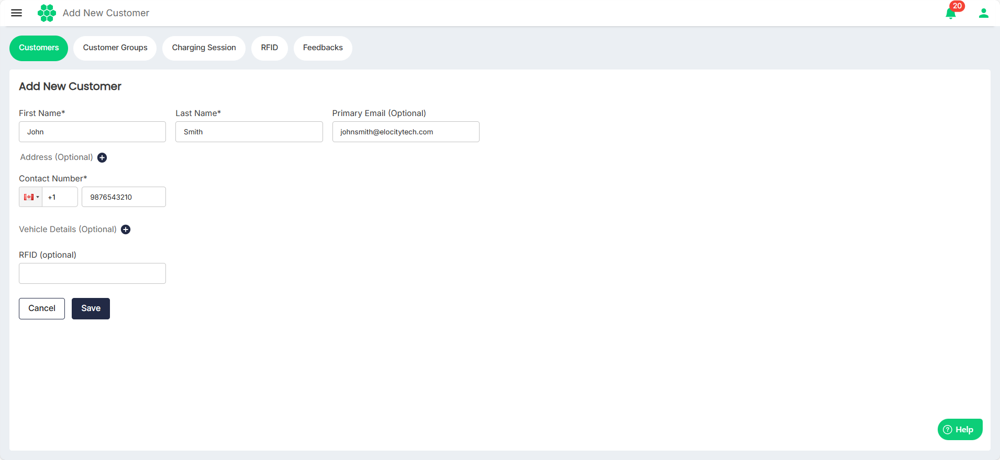
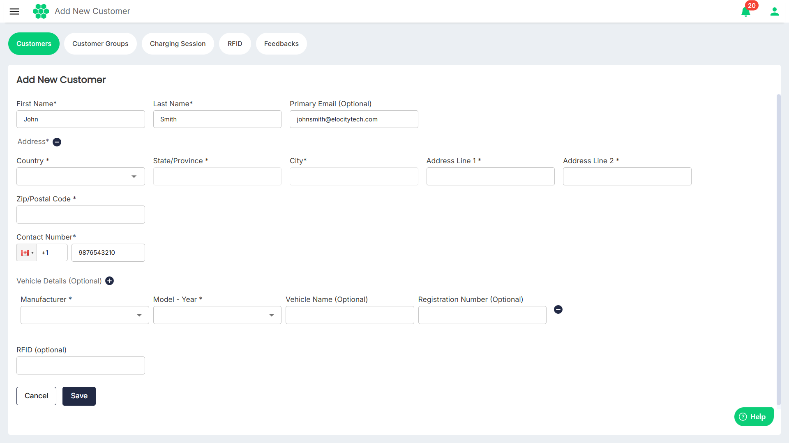

# Adding a New Customer

To add a new customer, follow these steps:
1. Navigate to **Customer** > **Customers**. The following screen appears:
2. Click on the **Add New Customer** button. 
3. Enter the customer details. 
4. To add the **Address** and **Vehicle Details**, click the corresponding **(+)** sign.
5. Click **Save**.
:::note
You can associate and more that one vehicle with a customer. 
:::
:::note
All the required fields marked with an asterisk __(*)__ are mandatory. 
:::