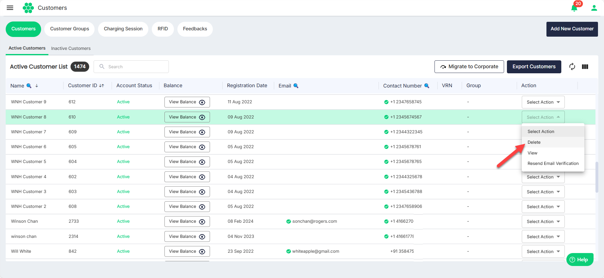
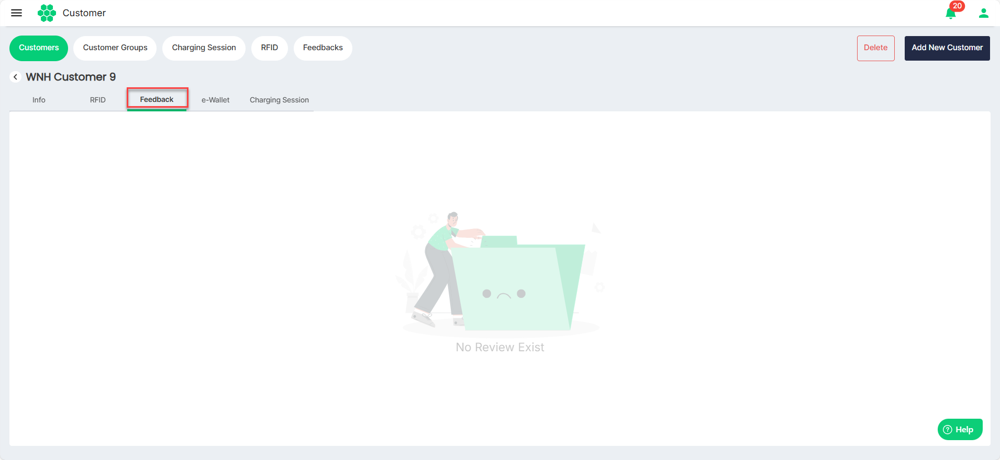
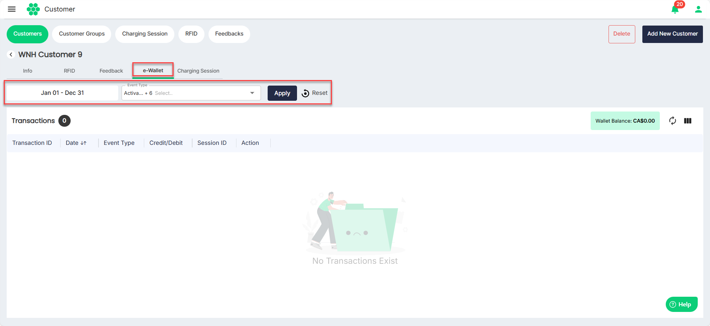
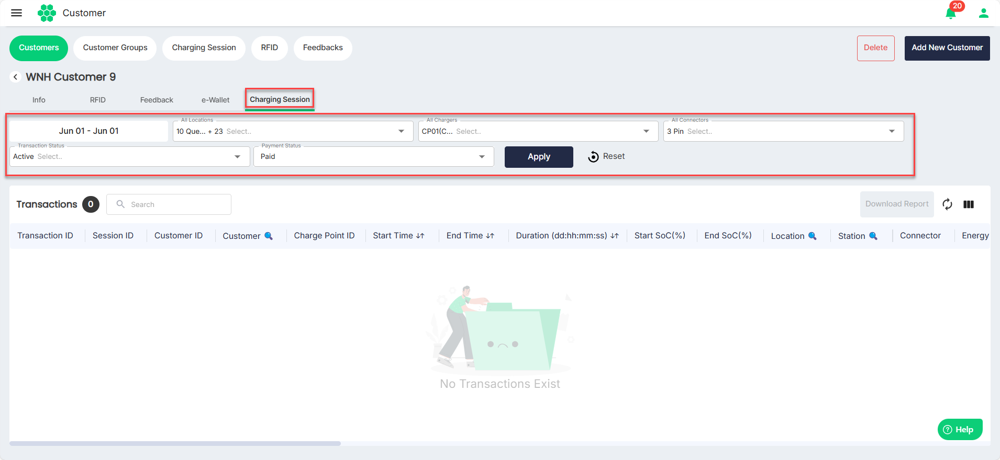

# Managing Active Customers
As part of managing active customers, you can perform the following tasks:
- [Viewing Active Customers](#viewing-active-customers)
- [Viewing Customer Details](#viewing-customer-details)
- [Deleting Customer](#deleting-customer)
- [Editing Customer Details](#editing-customer-details)
- [Managing RFID Details](#managing-rfid-details)
- [Viewing Feedback](#viewing-feedback)
- [Viewing e-Wallet](#e-wallet)
- [Charging Sessions](#charging-sessions)

## Viewing Active Customers

To view all the active customers in the system, navigate to **Customer** > **Customers**. The following screen appears that displays all the active customers under the **Active Customers** tab.
## Viewing Customer Details
Click anywhere on the customer's record that you want to view. The following screen appears that shows all the customer details:
## Deleting Customer
To delete a customer, select **Delete** from the **Select Action** drop-down list. The deleted customer does not get deleted from the system. Instead, it is moved under the [Inactive Customers](ManagingInactiveCustomers) tab.

## Editing Customer Details
1. Click on the **Edit** button. The following screen appears:
2. Under the Info tab, make the desired changes.
3. Click **Save**.

## Managing RFID Details
1. Navigate to the **RFID** tab, the following screen appears:
	- To associate a new RFID with a customer, click the **Add RFID** button, provide all the necessary details and click **Save**.
	- To edit the RFID details associated with a customer, select **Edit** from the **Action** drop-down list. In the screen that appears, make the desired changes, then click Save.
	- To delete the RFID associated with the customer, select **Delete** from the **Action** drop-down list.
## Viewing Feedback
Navigate to the **Feedback** tab, the following screen appears, which shows the feedback received from the customer.

## e-Wallet
Navigate to the **e-Wallet** tab, the following screen appears, which shows the customer's e-wallet balance along with the transactions made in the past.
You can use the **Date** and **Event Type** filters to limit the number of transactions you want to view.

## Charging Sessions
Navigate to the **Charging Session** tab, the following screen appears, which shows the customer's charging sessions in the past.
You can use the following filters to limit the number of transactions you want to view:
- **Date** 
- **All Locations**
- **All Chargers**
- **All Connectors**
- **Transaction Status**
- **Payment Status** 

Click the **Download Report** button to download the transaction details in a .CSV format.

