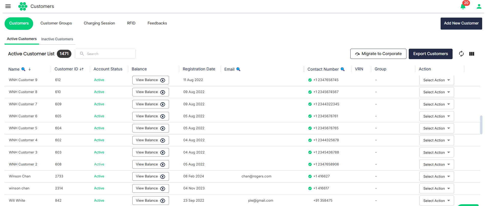
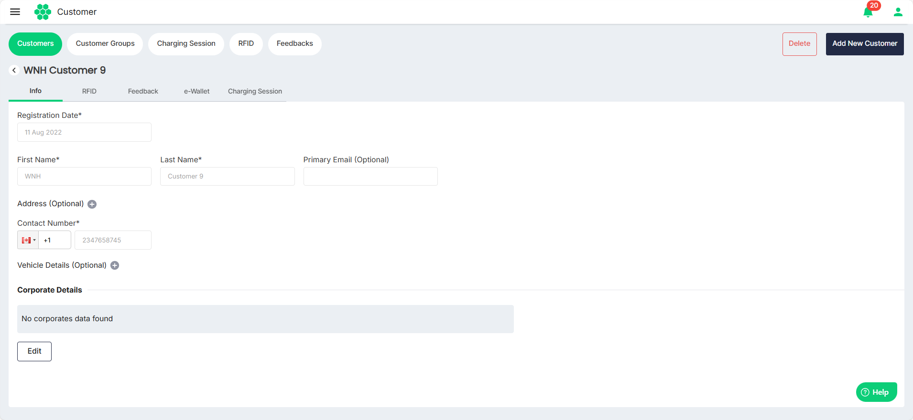
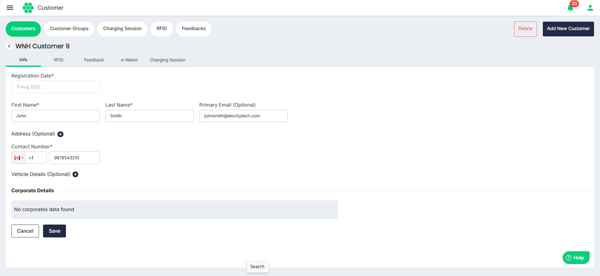
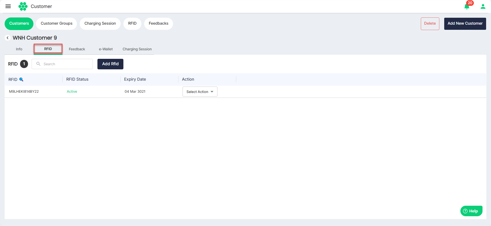
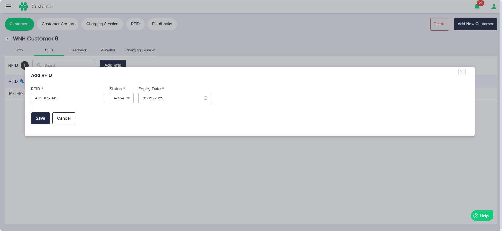
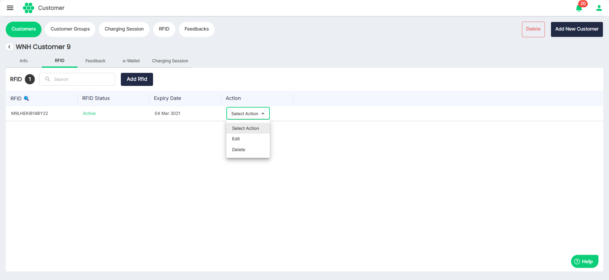

# Managing Active Customers
- [Viewing Active Customers](#viewing-active-customers)
- [Viewing Customer Details](#viewing-customer-details)
- [Editing Customer Details](#editing-customer-details)
- [Managing RFID Details](#managing-rfid-details)
- [Viewing Feedback](#viewing-feedback)

## Viewing Active Customers

To view all the active customers in the system, follow these steps:, navigate to **Customer** > **Customers**. The following screen appears that displays all the active customers under the **Active Customers** tab.
## Viewing Customer Details
Click anywhere on the customer's record that you want to view. The following screen appears that shows all the customer details:
## Editing Customer Details
1. Click on the **Edit** button. The following screen appears:
2. Under the Info tab, make the desired changes.
3. Click **Save**.

## Managing RFID Details
1. Navigate to the **RFID** tab, the following screen appears:
	- To associate a new RFID with a customer, click the **Add RFID** button, provide all the necessary details and click **Save**.
	- To edit the RFID details associated with a customer, select **Edit** from the **Action** drop-down list. In the screen that appears, make the desired changes, then click Save.
	- To delete the RFID associated with the customer, select **Delete** from the **Action** drop-down list.
## Viewing Feedback

