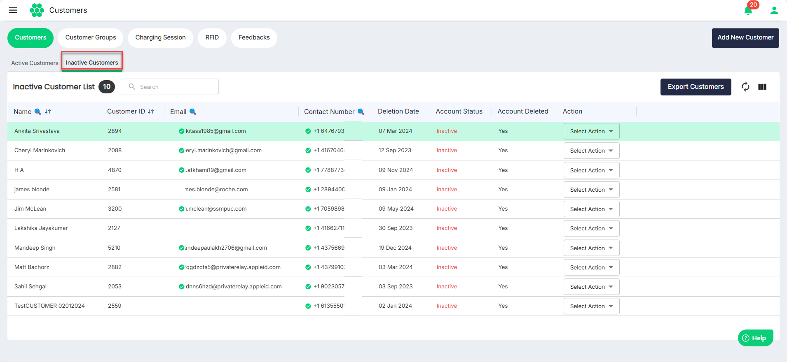
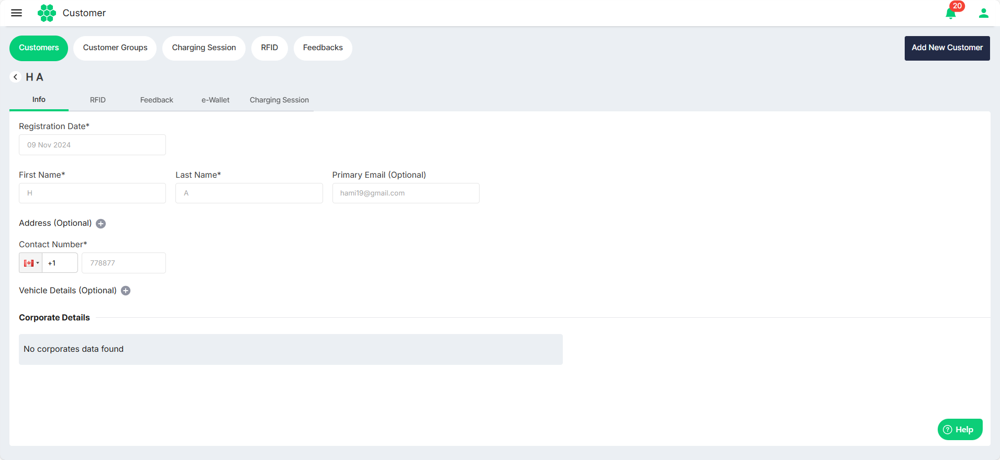
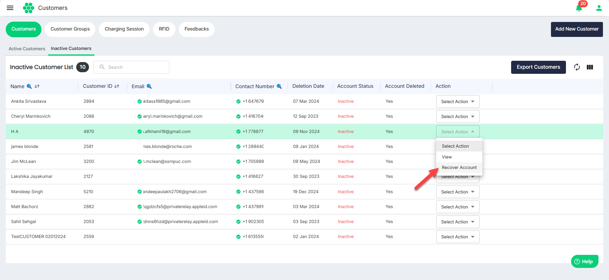

# Managing Inactive Customers
As part of managing inactive customers, you can perform the following tasks:
- [Viewing Inactive Customers](#viewing-inactive-customers)
- [Recovering Account](#recovering-account)
- [Exporting Inactive Customers](#exporting-inactive-customers)
## Viewing Inactive Customers
To view all the inactive customers in the system, navigate to **Customer** > **Customers**. The following screen appears that displays all the inactive customers under the **Inactive Customers** tab.

## Viewing Inactive Customer Details
Click anywhere on the inactive customer's record that you want to view. The following screen appears that shows all the inactive customer details:

## Recovering Account
To recover an inactive account, follow these steps:
1. Navigate to **Customer** > **Customers**. The following screen appears that displays all the inactive customers under the **Inactive Customers** tab.
2. From the **Select Action** drop-down list, select **Recover Account**.
   The customer is migrate from the **Inactive Customer** tab to the **Active Customers** tab.
## Exporting Inactive Customers
To export inactive customers to a .CSV file, follow these steps:
1. Navigate to **Customer** > **Customers**. The following screen appears that displays all the inactive customers under the **Inactive Customers** tab.
2. Click on the **Export Customers** button.