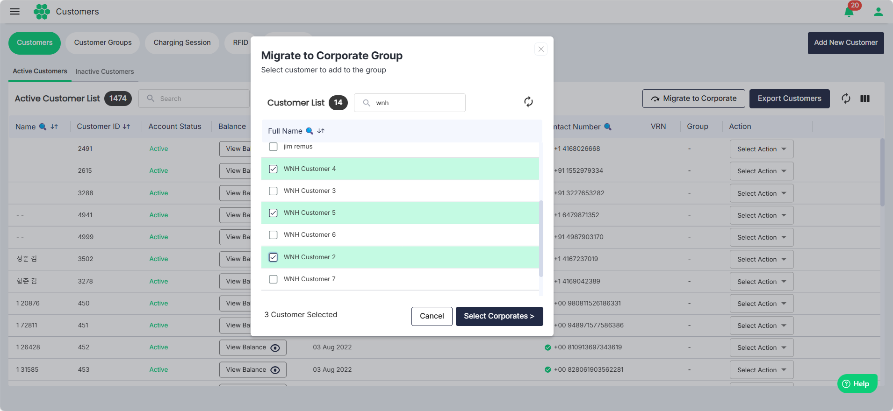
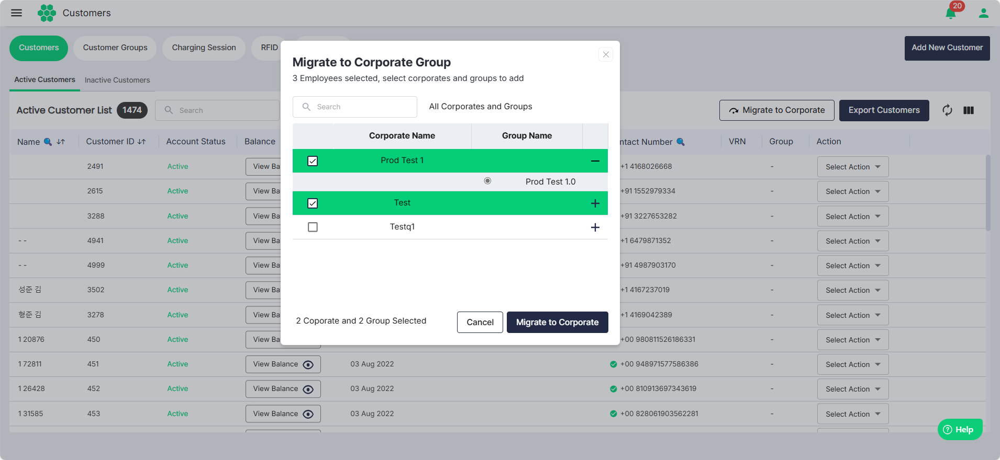

# Migrating Customers to Corporates

To migrate active customers to corporates, follow these steps:
1. Navigate to **Customer** > **Customers**. The following screen appears that displays all the active customers under the **Active Customers** tab.
2. Click on the **Migrate to Corporate** button. The following screen appears:
3. Select all the customers you want to migrate to corporate.
4. Click on the **Select Corporates** button. The following screen appears:
5. Select the **Corporate Names** and associated **Group Names** where you want to migrate the selected customers.
6. Click the **Migrate to Corporate** button.