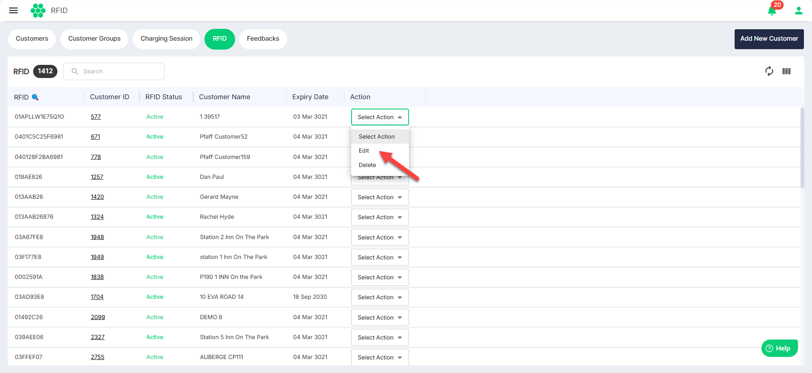
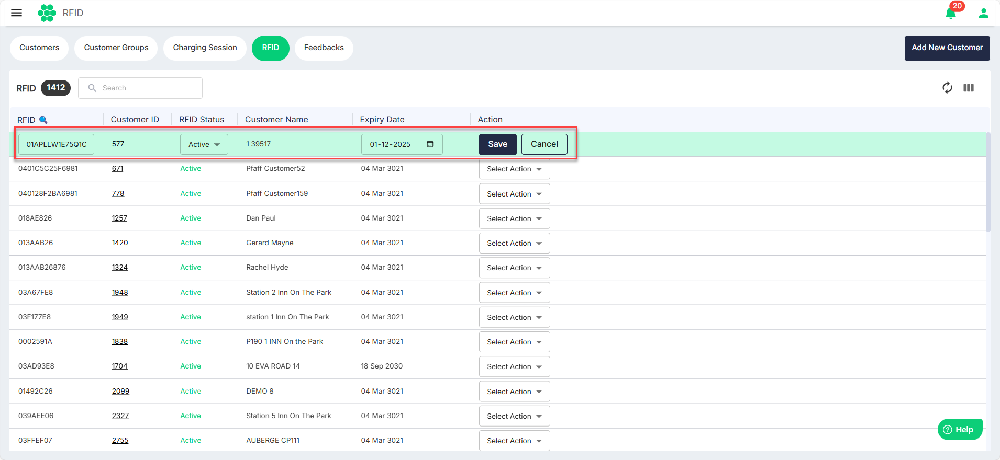
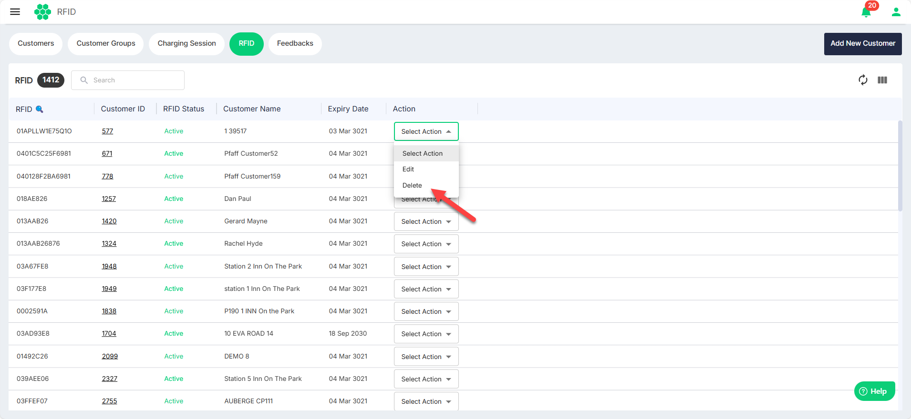

# Managing RFIDs
As part of managing RFIDs, you can perform the following tasks:
- [Viewing RFIDs](#viewing-rfids)
- [Editing an RFID](#editing-an-rfid)
- [Deleting an RFID](#deleting-an-rfid)
## Viewing RFIDs
To view all the RFIDs in the system, navigate to **Customer** > **RFID**. The following screen appears that displays all the RFIDs along with the associated details:

## Editing an RFID
1. To edit an RFID, select the **Edit** from the **Select Action** drop-down list.
2. Make the desired changes, and click **Save**.

## Deleting an RFID
1. To delete an RFID, select the **Delete** from the **Select Action** drop-down list.
2. Click **Delete**