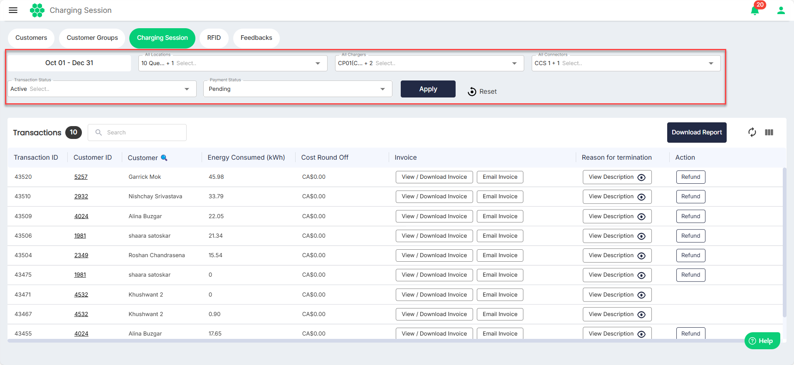
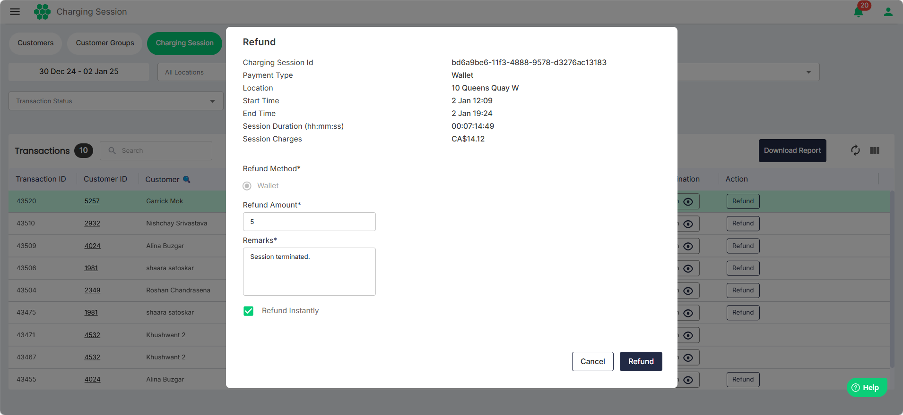

# Viewing Charging Sessions

To view all the charging session transactions in the system, navigate to **Customer** > **Charging Session**. The following screen appears:
- You can use the following filters to limit the number of transactions you want to view:
	- **Date** 
	- **All Locations**
	- **All Chargers**
	- **All Connectors**
	- **Transaction Status**
	- **Payment Status**
- To download the transaction details in a .CSV format, click the **Download Report** button.
- To view and download the invoice, click the **View/Download Invoice** button.
- To email the invoice to a customer, click the corresponding **Email Invoice** button.
- To view the reason for the termination of the session, click the corresponding **View Description** button.
- To initiate to a customer, click the corresponding **Refund** button. The following screen appears:
- Enter the **Refund Amount** and **Remarks**. Then, click the Refund button.