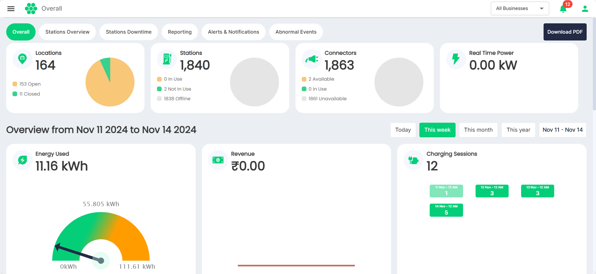

# Dashboard Overview

The Dashboard is designed to provide you with a powerful overview of your EV charging operations, bringing essential metrics and insights into one centralized location. With each widget delivering valuable, actionable information, you can make data-driven decisions to enhance efficiency, maximize uptime, and optimize your EV charging business. 

Here is a breakdown of the key metrics available on your main dashboard:

- **Locations**: View the number of open and closed locations as well as in a pie chart format.    
- **Stations**: Monitor the operational status of all the stations to ensure that they are running smoothly.    
- **Connectors**: Track each connector’s operational status, helping you maintain hardware effectively and respond promptly to any issues.    
- **Real-Time Power**: Get a live view of current power consumption across your network, enabling you to manage demand efficiently and prevent overloads.
- **Energy Used**: Access detailed data on total energy consumed over a select time period, giving you insights into energy costs and supporting sustainability goals.    
- **Revenue**: Monitor revenue generation trends across your network, providing insights into financial performance and profitability.    
- **Charging Sessions**: View the charging sessions over a select time period.    
- **Utilization**: View cumulative utilization hours across your network, helping you assess and improve the availability and accessibility of your charging network.    
- **Average Session Length**: Analyze the average length of charging sessions to gauge typical user engagement and optimize session flow.
- **Unique Drivers**: View the number of unique users, helping you understand customer reach and assess engagement levels.    
- **Station Outages**: Track any station downtimes, allowing you to respond quickly to minimize disruptions and maintain high reliability.
- **Connector Faults**: Monitor faults at the connector level, providing the data needed to troubleshoot issues and improve operational stability.