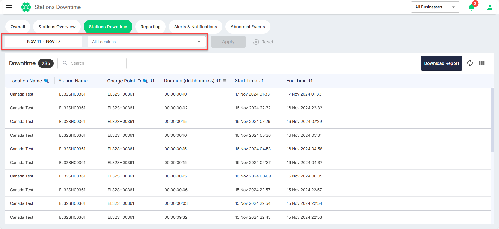
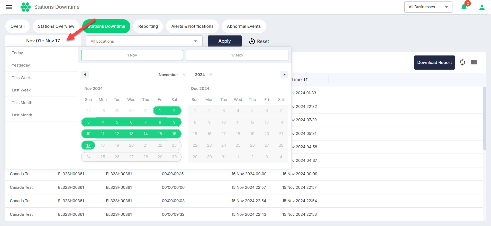
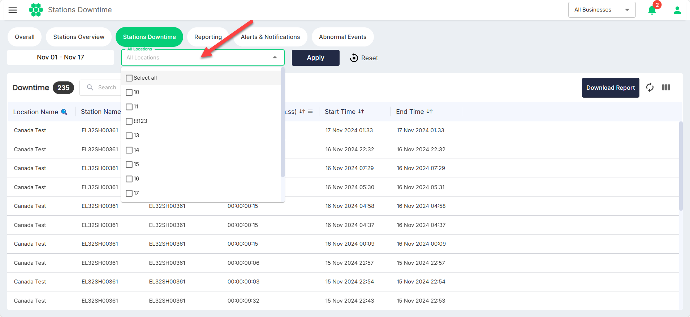

# Stations Downtime

The station downtime section enables users to monitor the history of charge point disconnections from the Elocity HIEV network, along with the duration of each session. This feature allows for a comprehensive view of the charging infrastructure's historical performance.

To facilitate easy monitoring, date-based filtering and  location-based options are available.

## Date Filtering
You can narrow down the view based on specific date ranges, aiding in the identification of historical downtime.

## Location Filtering
You can filter downtime events based on specific locations, allowing for a focused analysis of downtime occurrences.

