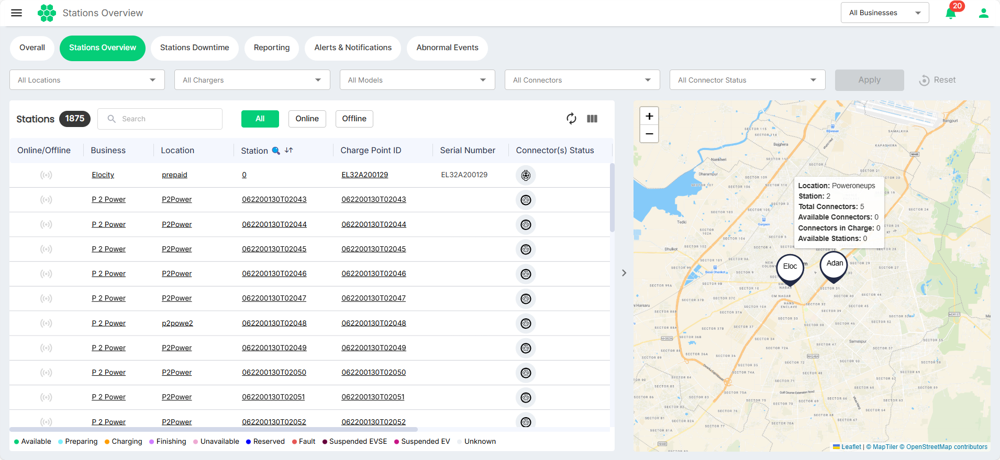
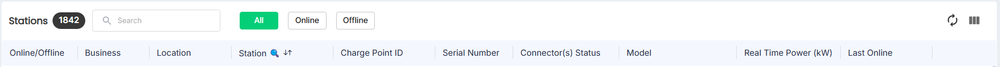
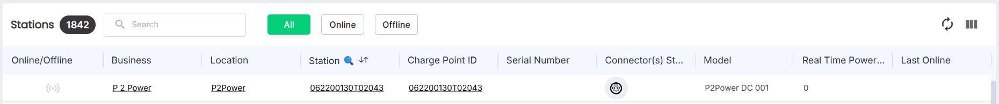
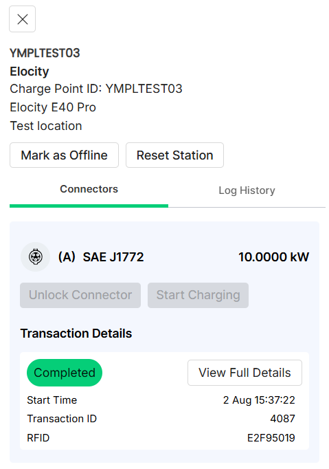

# Stations Overview

This Stations Overview screen offers real-time, detailed information about the status of each station charge point, giving users a comprehensive view of the entire charging infrastructure.

CPOs can use the following filters to refine their view and focus on specific charging stations:

- **Locations**: Filter stations by their physical locations to focus on specific geographical areas.
- **Chargers**: Filter stations by name to find specific stations quickly.
- **Models**: Categorize stations by their models to identify and monitor specific types of charging stations.
- **Connector Types**: Filter stations based on the types of connectors they support to manage charging equipment by connector compatibility.
- **Connector Status**: Filter stations by connector status to target stations based on the current status of their connectors.

The variety of filtering options ensures that you can easily navigate to the stations or groups of stations that need monitoring, improving the efficiency of your management tasks.

With real-time data and flexible filtering capabilities, you can proactively monitor charging stations, quickly resolve issues, and maintain optimal performance across the infrastructure.

Additionally, you can use the search function (indicated by the lens icon    to highlight search-enabled fields) and the online/offline filter to swiftly find specific chargers.

:::note
In addition to the filtered data being displayed in the tabular format, the map on the right also refreshes to display the filtered details related to the charging stations. You can zoom in over the map to view granular details and hover your mouse over locations to view details.
:::
## Connector Status

The following table lists the different states of a station connector.

| Color Code                                 | Status      | Description                                                                                                                                                                                 |
| ------------------------------------------ | ----------- | ------------------------------------------------------------------------------------------------------------------------------------------------------------------------------------------- |
| 

   | Available   | The station is ready for a new charging session.                                                                                                                                            |
| 

     | Preparing   | The connector is in the process of starting a new charging session when an ID tag (RFID card or mobile application) is presented, or when the charging connector is connected to a vehicle. |
| 

 | Charging    | An ongoing charging session is in progress.                                                                                                                                                 |
| 

 | Finishing   | Charging has stopped, and the station is waiting for the connector to be disconnected.                                                                                                      |
| 

     | Unavailable | The station is not available for a new session, possibly due to a change in availability by the charge point operator.                                                                      |
| 

     | Reserved    | The station is reserved for a particular ID tag                                                                                                                                             |
| 

       | Fault       | The charger has reported an error and is inoperative until the issue is resolved.                                                                                                           |
| 

     | Unknown     | The status of the station is unknown, which is due to a lack of connection between the charger and the web portal.                                                                          |
## Navigation Links

You can easily navigate to related pages for more detailed insights by clicking in the corresponding fields of the station.
- **Business:** Redirects to the Edit Business screen to view/edit the business details if required.
- **Location:** Redirects to the Location Details screen, providing insights into specific geographical areas.
- **Station**: Opens the [Station Actions](#station-actions) panel on the right where you can perform additional tasks related to the station.
- **Charge Point ID:** Redirects to the Station Management screen, which offers additional details on individual charging points.

### Station Actions

The Station Actions panel appears on this right when you click on the Station Name in the Station Overview screen. You can perform the following additional operations from this screen:

- **Mark as Offline:** Flag a charger as offline for maintenance or other purposes.
- **Reset Station:** Perform a charger reset as needed.
- **Unlock Connector:** Unlock connectors for troubleshooting or maintenance.    
- **Start/Stop Charging:** Start or Stop charging sessions remotely from the CSMS.
  :::note
	An ID Tag associated with a customer is required to initiate a charging session.
	:::  
- **Transaction Details**: View details such as start time, transaction ID, RFID, and so on.
- **Log History**: View events logs.

