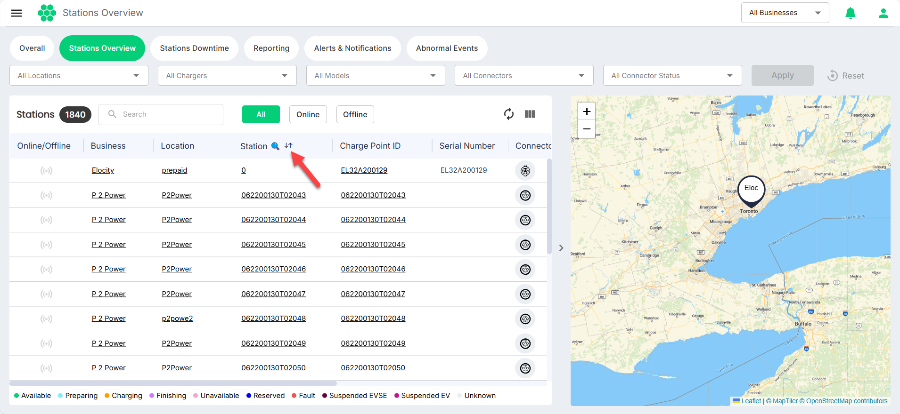
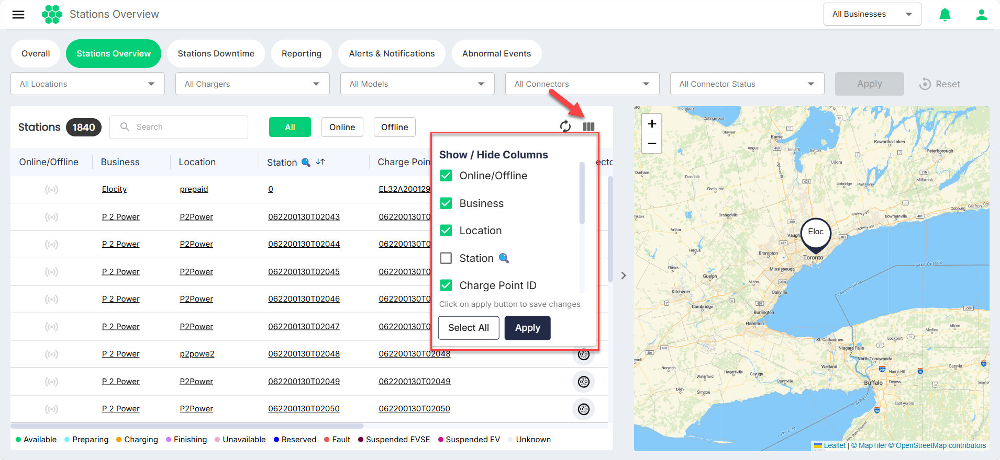
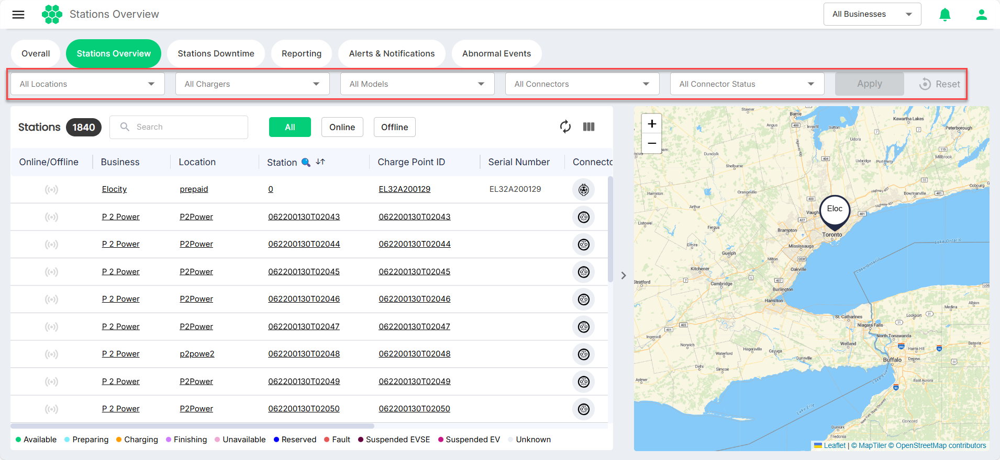
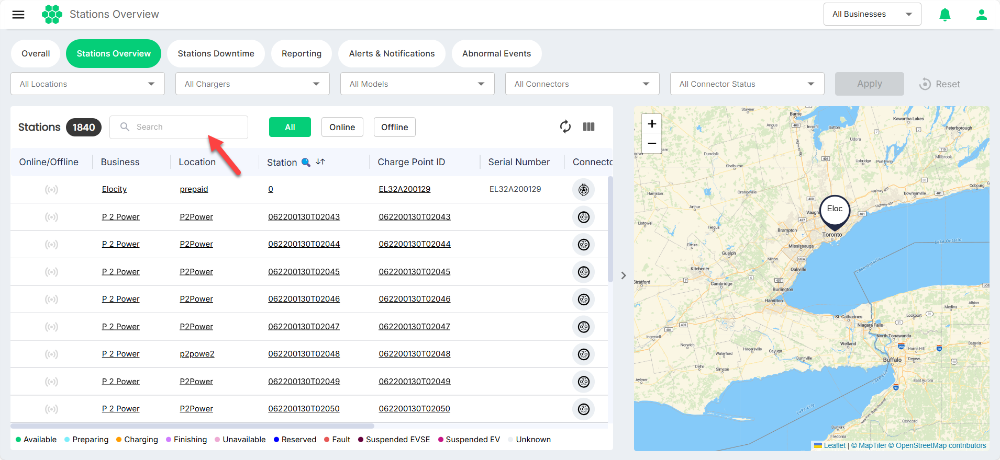

# Global Actions

The [hiev.ca](https://hiev.ca) dashboard provides global actions that enhance data visibility and customization. These actions allow you to tailor the interface for streamlined monitoring and decision-making. These actions are essential tools for optimizing how you view and interact with data on the dashboard, helping to quickly analyze the most relevant information.

Key global actions include:

- **[Sorting](#sorting)**: Organize data by ascending or descending order across various columns (for example, date, usage, status, etc.)
- **[Hiding/Unhiding Columns](#hiding-and-unhiding-columns)**: Customize your view by hiding or unhiding columns as needed.
- **[Filtering Data](#filtering-data)**: Apply filters to narrow down data based on specific criteria.
- **[Searching Data](#searching-data)**: Use the global search bar to locate specific data points or entries within the dashboard.

## Sorting
To sort data by ascending or descending order across various columns, click on the column headers with up/down arrows.
 

## Hiding and Unhiding Columns
Click on the column icon, and select the columns you want to hide or unhide.

## Filtering Data
You can apply filters to narrow down data based on specific criteria. To do so, select the predefined filters, and click **Apply**.

## Searching Data
You can the global search bar to locate specific data points or entries within the dashboard.

