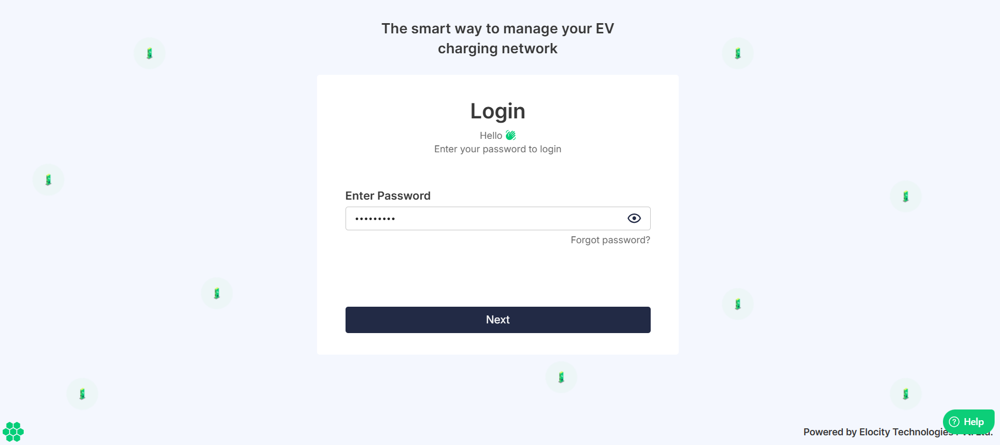
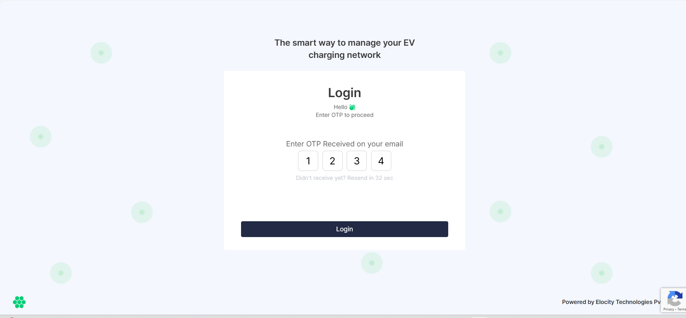

# Logging In
Follow these steps to log in to the Elocity HIEV Portal.
1. Open your web browser and navigate to the [Elocity HIEV Portal](https://hiev.ca).
   

3. Enter your registered email address, and click the **Next** button.
   
3. Enter your password, and click the **Next** button.
4. Enter the four-digit one-time password (OTP) received in your registered email.
5. Click the **Login** button.