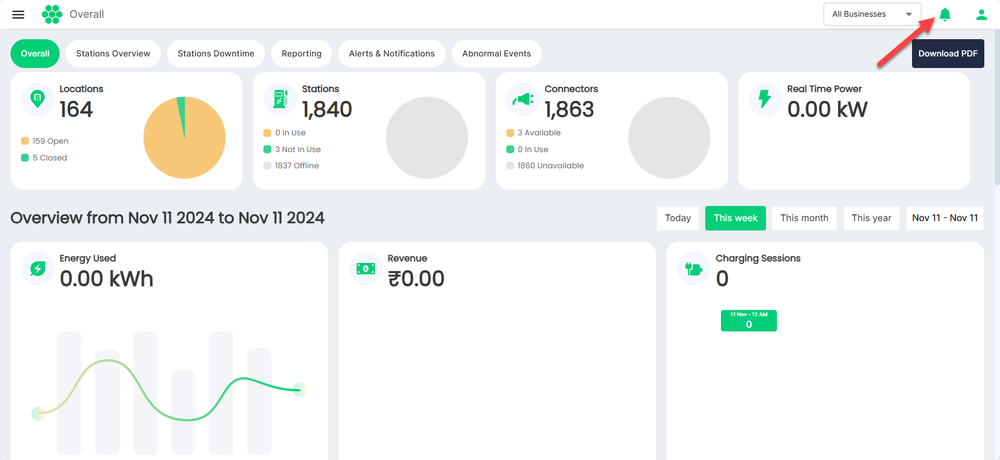
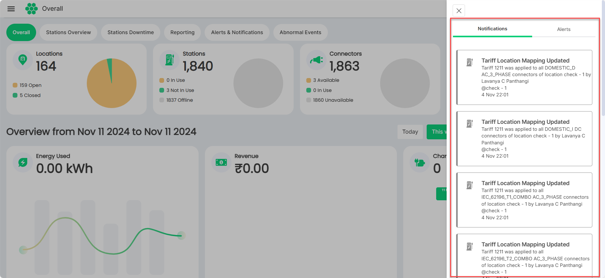

# Notifications and Alerts

The [hiev.ca](https://hiev.ca) dashboard features a dynamic **Notifications and Alerts** system, designed to keep you informed of important events and system changes in real-time. These notifications and alerts help you stay updated on critical issues such as network connectivity, charging station status, and energy usage patterns. These alerts and notifications help you take proactive steps to maintain optimal performance.

**Types of Notifications and Alerts**:

- **System Health Alerts**: Receive real-time updates on the operational status of the [hiev.ca](https://hiev.ca) network, including connectivity disruptions and performance issues.
- **Usage and Demand Alerts**: Stay informed about peak energy usage times and sudden demand spikes, allowing for quick adjustments to optimize resource allocation.
- **Maintenance Reminders**: Automatic reminders for scheduled maintenance help ensure that charging infrastructure remains in top condition, minimizing downtime.
- **User Activity Notifications**: Monitor key user actions, including new user registrations, permission changes, and account access alerts to enhance system security.

To view the alerts and notification, click on the 
icon in the top-right corner of the screen.

The Notifications and Alerts panels appear on the right.

