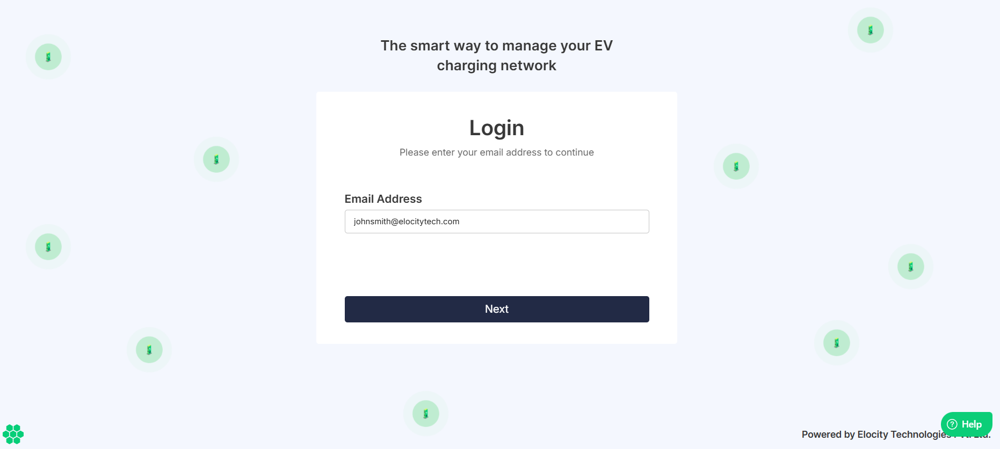
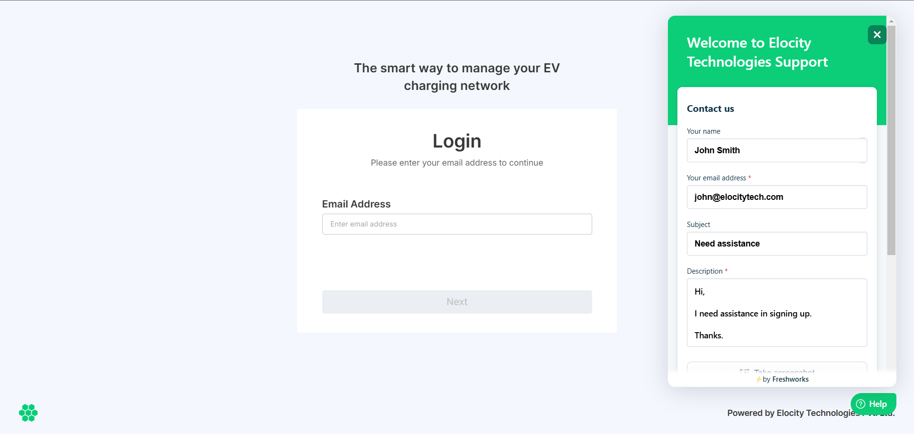

# Reaching Out for Help

If you have questions or need support, help is just a click away! 

1. Click the **Help** button located at the bottom-right corner of your screen to connect with our support team.

1. A window opens where you can provide **Your Name**, **Email Address**, **Subject**, and **Description**.

1. In addition, you can take a screenshot that you may want to share with the support team or upload up to five files with your message.
2. Then, click the **Send** button.

Someone from the Elocity support team will reach out to you for assistance as soon as possible.