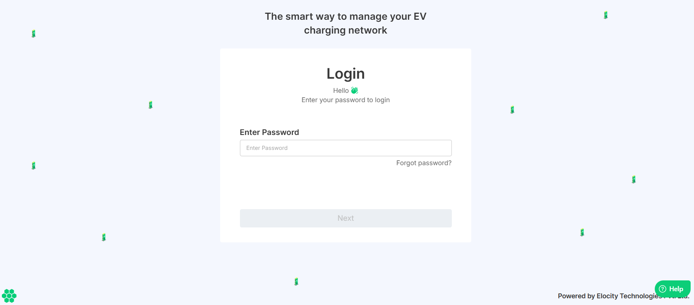
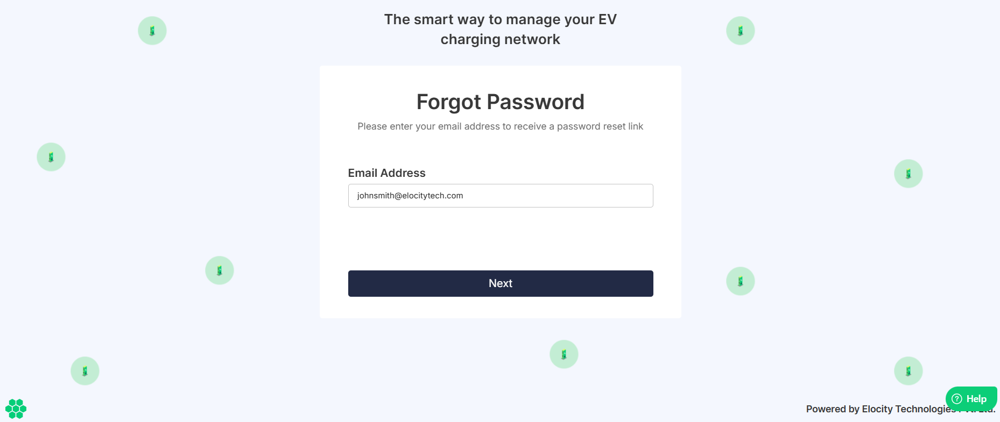
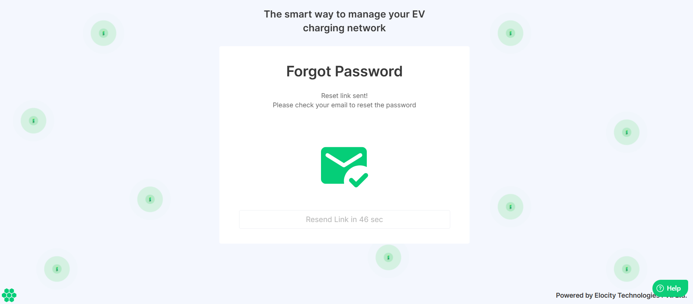

# Resetting Password

To reset a forgotten password, follow these steps:
1. Open your web browser and navigate to the [Elocity HIEV Portal](https://hiev.ca).
   

3. Enter your registered email address, and click **Next**.
   

4. Click on the **Forgot password?** link.
   

5. Enter your email ID, and click **Next**.
   

	After submitting your email address, a password reset link is sent to the registered email ID. 

8. Open your email, and click on the **Reset Link**. You will be redirected you to a new webpage where you can set a new password.
   	:::note
	Check your email inbox for the password reset email from Elocity HIEV Dashboard. If you did not receive the email, check your junk or spam folder before retrying.

	:::
9. Enter your new password and confirm the password change by re-entering the same password in the designated confirmation field. Ensure that both passwords match exactly to avoid any errors.
   
10. Click **Reset Password**.
	Your password will be successfully updated, and you'll receive a confirmation message.
	

:::info
If you encounter any issues during the password reset process, you can reach out to the support team for assistance.
:::