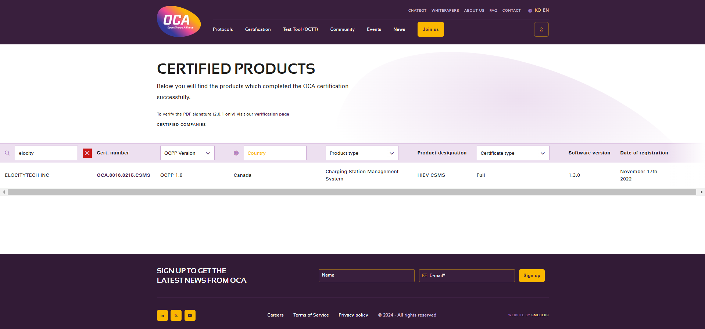

# Standards and Certifications

We follow open and interoperable standards for the benefit of the entire EV charger sector. The following table lists some of the global organizations we work with are:

- [OpenADR Alliance – OADR](https://www.openadr.org) 
- [Open Charge Alliance – OCA](https://www.openchargealliance.org)    
- [Energy Web Foundation – EWF](https://www.energyweb.org)
- [Smart Electric Power Alliance – SEPA](https://sepapower.org/about)
- [New York State Energy Research and Development Authority – NYSERDA](https://www.nyserda.ny.gov)
- [Columbia Technology Ventures](https://techventures.columbia.edu)

Elocity is the first Canadian company to get full [OCPP certification from Open Charge Alliance](https://www.openchargealliance.org/certification/certifiedcompanies).

[Click here](https://openchargealliance.org/wp-content/uploads/2023/12/Certificate_OCA.0016.0215.CSMS_ELOCITYTECH.pdf) to view the certificate.
