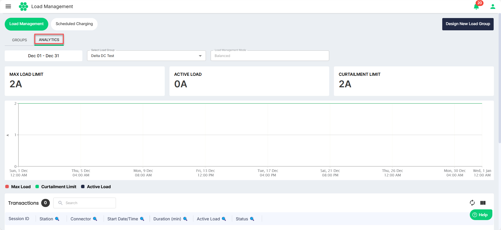
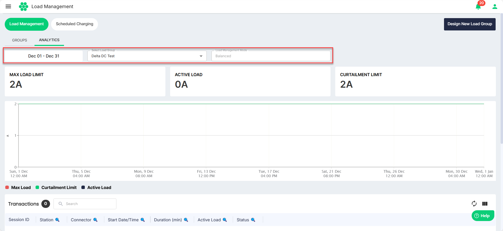

# Analytics

Analytics provide actionable insights into energy consumption, EV charging patterns, and grid optimization, enabling data-driven decision-making for businesses and utilities. These analytics help monitor energy usage, forecast demand, balance grid loads, and optimize EV charging schedules to enhance operational efficiency. Additionally, they track sustainability metrics, such as carbon emission reductions, and offer customer behavior insights to improve user experiences. By analyzing financial performance and station utilization, Elocity's analytics empower stakeholders to achieve energy efficiency, grid stability, and sustainability goals while maximizing ROI.

To view the analytics, follow these steps:
1. Navigate to **Load Management** > **Load Management**.
2. Navigate to the **Analytics** tab. The following screen appears:
3. Use the filters to view the desired analytics.