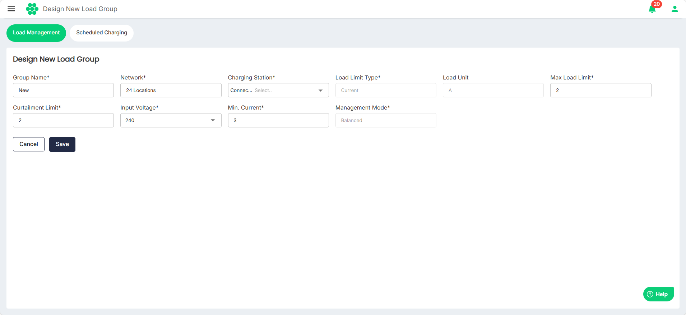

# Designing a New Load Management Group
To design a new load management group, follow these steps:
1. Navigate to **Load Management** > **Design New Load Group**. The following screen appears:
2. Enter the following details:
	- **Group Name**: Enter the name of the load management group.
	- **Network**: Select the locations where the load group is being created.
	- **Charging Station**: Select the stations that share the same load input for load management.
	- **Load Limit Type**: Choose between current or power as the parameter for reducing the overall load of chargers.
	- **Max Load Limit**: Maximum load allowed for the group.
	- **Curtailment Limit**: Set this slightly less than the max load limit to ensure safe operation of EV chargers; the optimization algorithm uses this number to keep the overall load within limits.
	- **Input Voltage**: Voltage provided to the chargers.
	- **Min Current**: Minimum current required to keep each charger operational during load optimization.
	- **Management Mode**: Mode used for load optimization.
	    - **Balanced**: This mode distributes the available load equally among all chargers.
		:::note
		Fields marked with asterisk (__*__) are mandatory.
		:::
1. Click **Save**.

