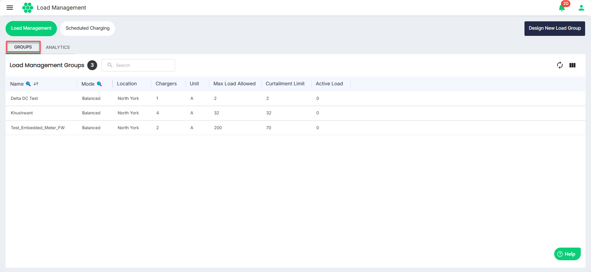
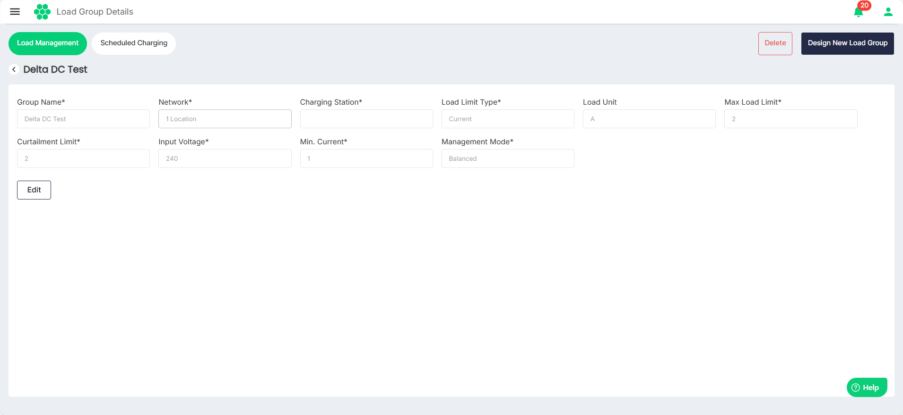
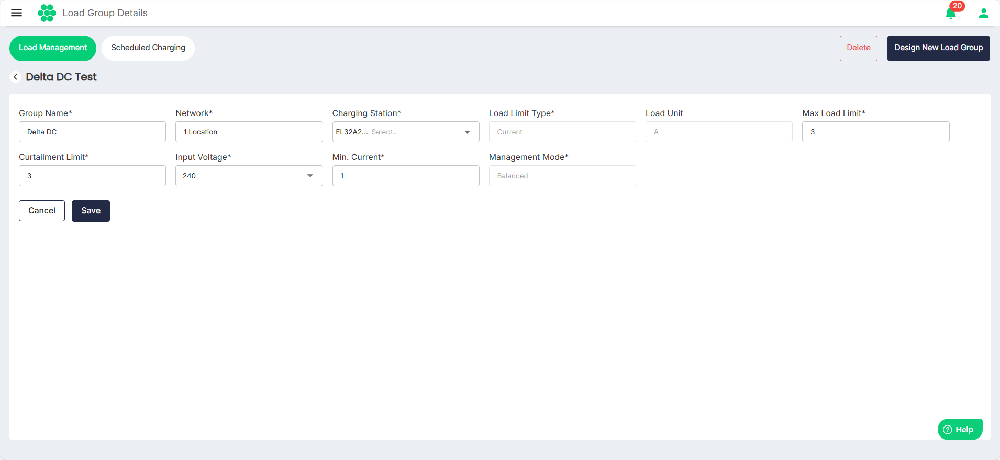

# Managing Load  Management Groups
As part of managing load groups, you can perform the following tasks:
- [View Load Managing Groups](#viewing-load-management-groups)
- [Edit Load Management Group](#editing-a-load-management-group)
- [Delete Load Management Group](#deleting-a-load-management-group)
## Viewing Load Management Groups
To view load management groups, follow these steps:
1. Navigate to **Load Management** > **Load Management**. The following screen appears that lists all the load management groups under the GROUPS tab.
2. To view the details associated with a load management group, click anywhere inside a load management group record.

## Editing a Load Management Group
To edit a load management group, follow these steps:
1. Navigate to **Load Management** > **Load Management**. The following screen appears that lists all the load management groups under the GROUPS tab.
2. To edit the details associated with a load management group, click anywhere inside the load management group record. The following screen appears:
3. Click **Edit**.
4. Make the desired changes.
5. Click **Save**.

## Deleting a Load Management Group
To delete a load management group, follow these steps:
1. Navigate to **Load Management** > **Load Management**. The following screen appears that lists all the load management groups under the GROUPS tab.
2. To delete a load management group, click anywhere inside the load management group record you want to delete.
3. Click **Delete**.
