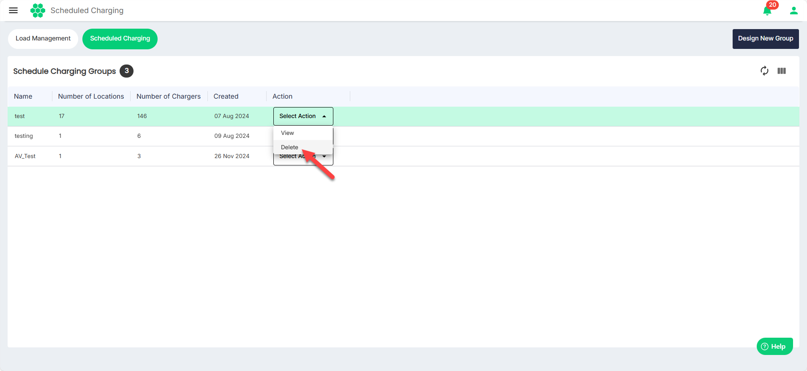

# Deleting a Scheduled Charging Group
To delete a scheduled charging group, follow these steps:
1. Navigate to **Load Management** > **Scheduled Charging**. The following screen appears that shows all the Scheduled Charging Groups:
2. To delete details associated with a charging group, select **Delete** from the **Select Action** drop-down list.