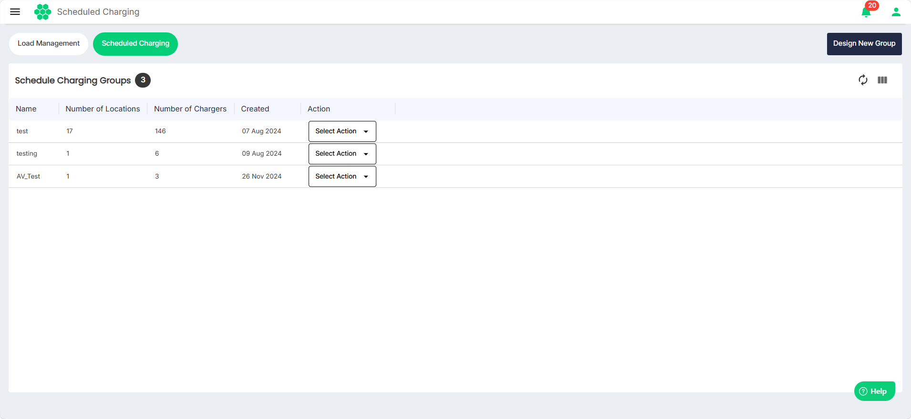
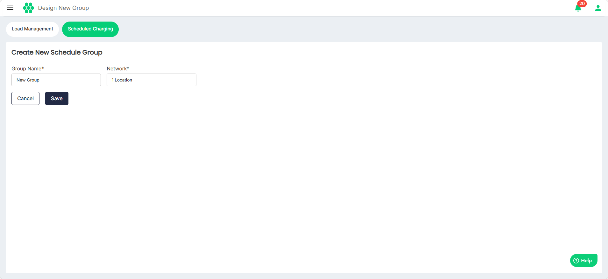
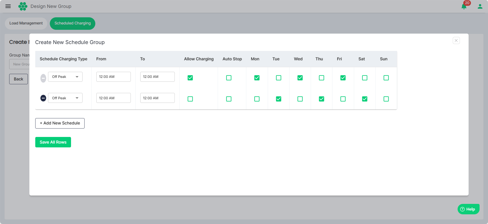

# Designing a Scheduled Group

The schedule allows users to choose the charging type (off-peak, mid-peak, on-peak, regular), set the start and end times for each type, and configure the following options:
- **Allow Charging**: Whether to allow new charging sessions during the current period.
- **Auto Stop**: Stop any ongoing charging sessions during this period.
- **Active Days**: Select the weekdays when this configuration should be active.

To design a scheduled charging group, follow these steps:
1. Navigate to **Load Management** > **Scheduled Charging**. The following screen appears:
2. Click on the **Design New Group** button. The following screen appears:L
3. Enter the **Group Name** and select the location from the **Network** drop-down list. Then, click **Save**. The following screen appears:
4. Make the desired updates.
		1. Select the **Schedule Charging Type** (**Off Peak**, **Mid Peak**, or **On Peak**). 
		2. Time Range (**From** and **To**)
		3. Select the **Allow Charging**, **Auto Stop**, and the **active days** as desired.
		4. Click **Add New Schedule** to add additional rows.
		5. Click the **(-)** button to delete the rows.
5. Click **Save All Rows**.