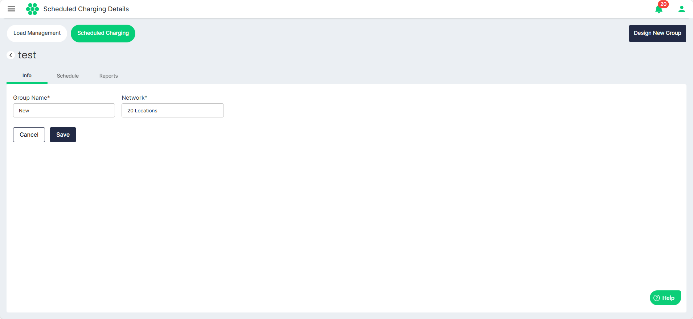
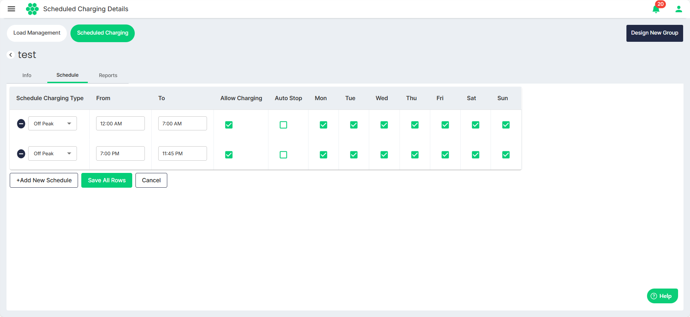

# Editing a Scheduled Charging Group
To edit a scheduled charging group, follow these steps:
1. Navigate to **Load Management** > **Scheduled Charging**. The following screen appears that shows all the Scheduled Charging Groups:
2. To edit details associated with a charging group, select **View** from the **Select Action** drop-down list.

The following screen appears that shows the editable details associated with the scheduled charging group under the following tabs:
- [Info](#editing-info)
- [Schedule](#editing-schedule)

### Editing Info
1. Navigate to the **Info** tab to view the group name and network.
2. Click **Edit**.
3. Make the desired changes.
4. Click **Save**.
### Editing Schedule
The schedule allows users to choose the charging type (off-peak, mid-peak, on-peak, regular), set the start and end times for each type, and edit the following options:
- **Allow Charging**: Whether to allow new charging sessions during the current period.
- **Auto Stop**: Stop any ongoing charging sessions during this period.
- **Active Days**: Select the weekdays when this configuration should be active.
1. Navigate to the **Schedule** tab to view the associated schedules.
2. Click **Edit**.
3. Make the desired changes.
4. Click **Add New Schedule** to add additional rows.
5. Click the **(-)** button to delete the rows.
6. Click **Save All Rows**.