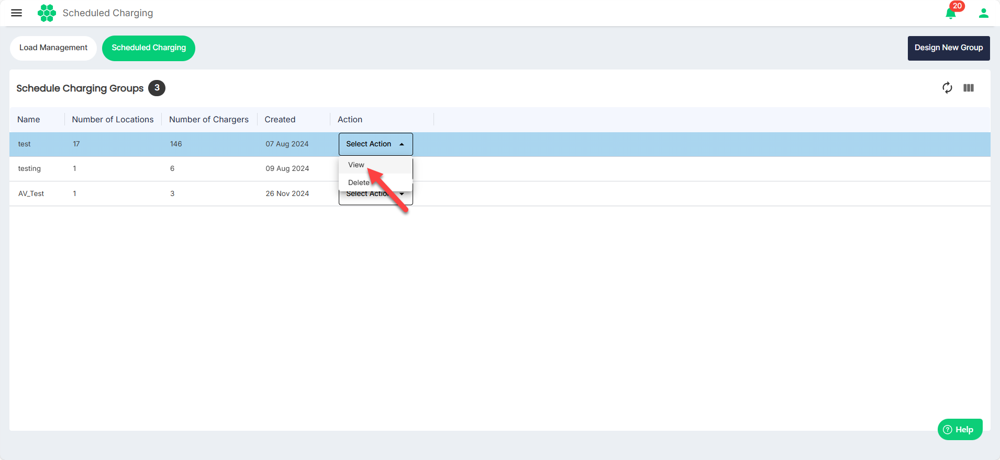
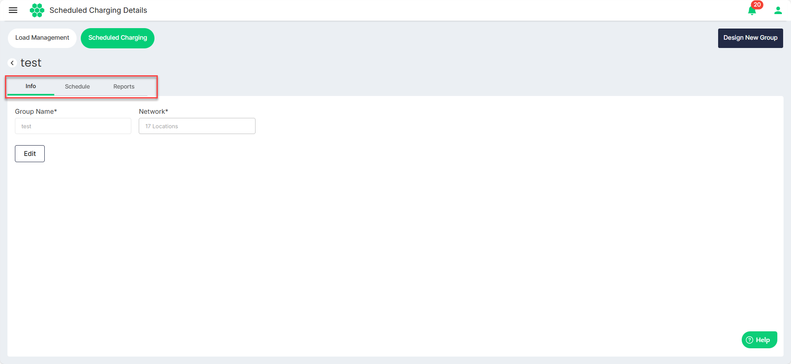
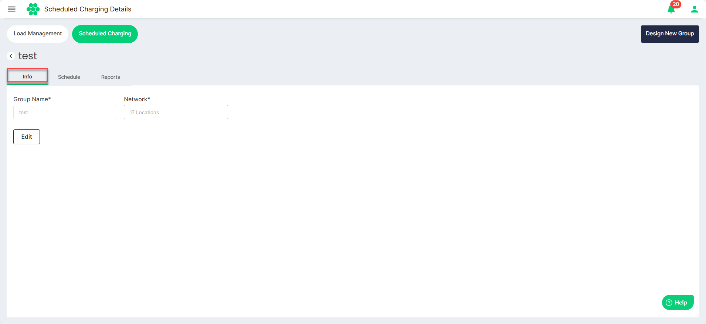
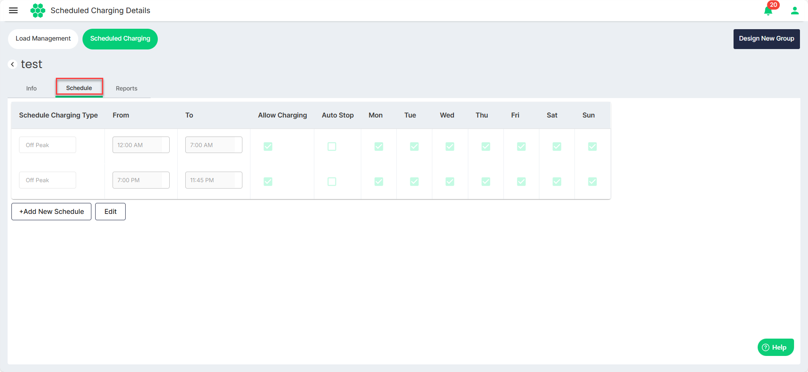
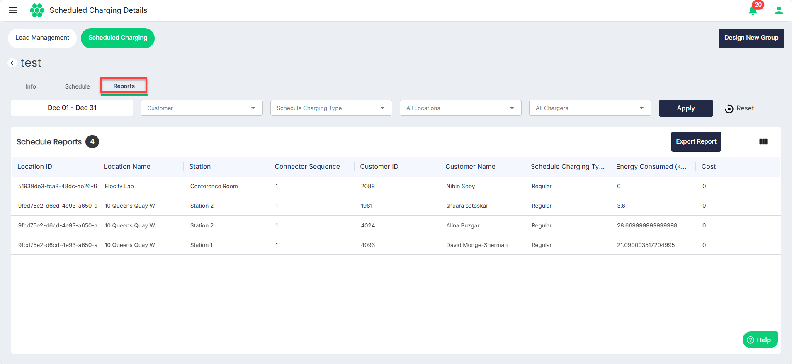

# Viewing Scheduled Charging Groups
To view scheduled charging groups, follow these steps:
1. Navigate to **Load Management** > **Scheduled Charging**. The following screen appears that shows all the Scheduled Charging Groups:
2. To view the details associated with a charging group, select **View** from the **Select Action** drop-down list.

The following screen appears that shows the details associated with the scheduled charging group under the following tabs:
- [Info](#viewing-info)
- [Schedule](#viewing-schedule)
- [Reports](#viewing-reports) 

### Viewing Info
Navigate to the **Info** tab to view the group name and network.

### Viewing Schedule
Navigate to the **Schedule** tab to view the associated schedules.

### Viewing Reports
Navigate to the **Reports** tab view or download the reports.

- Use the filters to trim down the number of records you want to view.
- Click on the **Export Report** button to download the records in a .CSV format.