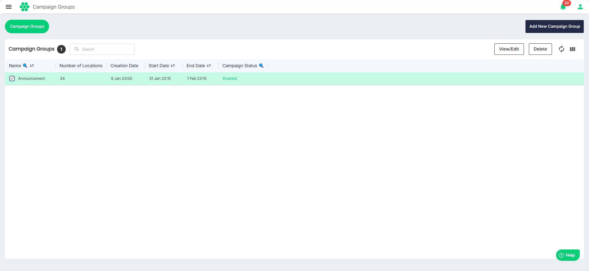
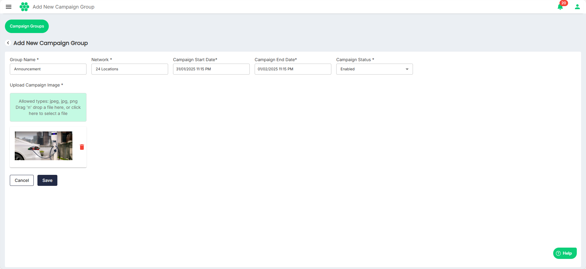

# Managing Campaign Groups

 Campaign Groups help organize and manage related campaigns under a unified structure, making it easier to track, analyze, and collaborate. They simplify reporting and enable segmentation based on goals, regions, or customer types.
As part of managing campaign groups, you can perform the following tasks:
- [Viewing and Editing Campaign Groups](#viewing-and-editing-campaign-groups)
- [Adding New Campaign Group](#adding-new-campaign-group)
## Viewing and Editing Campaign Groups
To view and edit campaign groups, follow these steps:
Navigate to **Invoice Campaigns** > **Campaign Groups**.
	- To view/edit a campaign group, select the campaign group, and then click the **View/Edit** button.
	- To delete a campaign group, select the campaign group, and then click the **Delete** button. 
## Adding New Campaign Group
To add a new campaign group, follow these steps:
1. Navigate to **Invoice Campaigns** > **Add New Campaign Group**. The following screen appears:
2. Enter/select the following details:
	- **Group Name**
	- **Network**
	- **Campaign Start Date**
	- **Campaign End Date**
	- **Campaign Status**
	- **Upload Campaign Image**
1. Click **Save**.

 
 