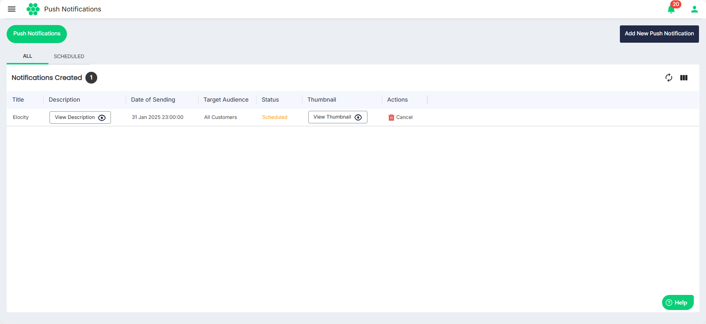
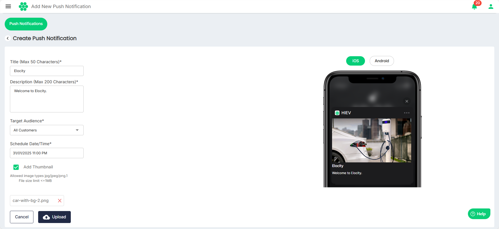

# Managing Notifications
As part of managing notifications, you can perform the following tasks:
- [Viewing Notifications](#viewing-notifications)
- [Adding Notifications](#adding-new-notification)
## Viewing Notifications
To view the notifications, navigate to **Notifications** > **Push Notifications**. The following screen appears that shows all the notifications under the **ALL** and **SCHEDULED** tabs:
You can perform the following tasks:
- **View Description** of the notification.
- **View Thumbnail** associated with the notification.
- **Cancel** notification.
## Adding New Notification
To add a new notification, follow these steps:
1. Navigate to **Notifications** > **Add New Push Notifications**. The following screen appears:
2. Enter the details:
	- **Title** of the notification.
	- **Description** of the notification.
	- Select the **Target Audience** from the drop-down list.
	- Select the **Schedule Date/Time**.
	- Select the **Add Thumbnail** option and **Upload** if you want to attach an image with the notification.
	:::note
	The image on the right shows how the notification and the thumbnail will appear on the recipients' iOS and Android devices.
	:::
1. Click **Save**.